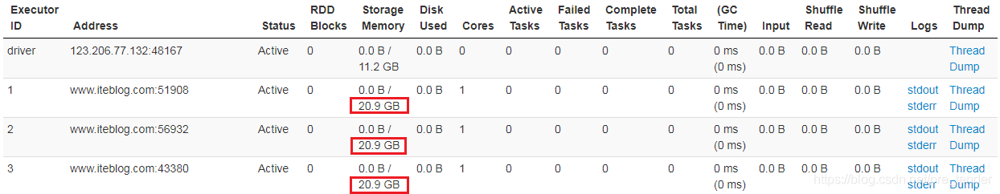

# 目录

[toc]

---

# Spark内存管理之堆内/堆外内存原理详解


仅做学习用，非原创文章，文章出处：https://blog.csdn.net/pre_tender/article/details/101517789

# 概要

介绍 Spark 内存管理中，涉及到的 ==**堆内内存 (On-heap Memory)**== 和 ==**堆外内存 (Off-heap Memory)**== 的相关原理介绍。

这部分主要在 org.apache.spark.memory.UnifiedMemoryManager.scala 文件中进行描述，关于源码剖析请参考 Spark 内存管理之 UnifiedMemoryManager 。

# 1. 前言
在执行 Spark 的应用程序时， Spark 集群会启动 Driver 和 Executor 两种 JVM 进程，
- **`Driver`** 为主控进程，负责创建 Spark 上下文，提交 Spark 作业（ Job ），并将作业转化为计算任务（ Task ），在各个 Executor 进程间协调任务的调度，
- **`Executor`** 负责在工作节点上执行具体的计算任务，并将结果返回给 Driver ，同时为需要持久化的 RDD 提供存储功能。

由于 Driver 的内存管理相对来说较为简单，本文主要对 Executor 的内存管理进行分析，
==下文中的 **Spark 内存** 均特指 **Executor 的内存**==。
</img>

# 2. 堆内和堆外内存
作为一个 JVM 进程， Executor 的内存管理建立在 JVM 的内存管理之上，
**Spark 对 JVM 的堆内（On-heap）空间进行了更为详细的分配**，以充分利用内存。
同时， **==Spark 引入了堆外（Off-heap）内存==，使之可以直接 ==<u>在工作节点的系统内存中开辟空间</u>==**，进一步优化了内存的使用。

</img>

## 2.1 堆内内存(On-heap Memory)

堆内内存的大小，由 Spark 应用程序启动时的 **`executor-memory`** 或 **`spark.executor.memory`** 参数配置。 

Executor 内运行的 Task 并发任务 **共享 JVM 堆内内存**，
- 这些 Task 任务在缓存 RDD 和广播（Broadcast）数据时占用的内存被规划为 **存储（Storage）内存**，
- 而这些 Task 任务在执行 Shuffle 时占用的内存被规划为 **执行（Execution）内存**，
- 剩余的部分不做特殊规划，

那些 Spark 内部的对象实例，或者用户定义的 Spark 应用程序中的对象实例，**均占用剩余的空间**。

不同的管理模式下，这三部分占用的空间大小各不相同（下面第 2 小节介绍）。

### 2.1.1 堆内内存的申请与释放
Spark 对堆内内存的管理是一种逻辑上的“规划式”的管理，
**因为对象实例占用内存的申请和释放都由 JVM 完成， Spark 只能在申请后和释放前 ==记录== 这些内存**：
> 申请内存：
Spark 在代码中 new 一个对象实例
JVM 从堆内内存分配空间，创建对象并返回对象引用
Spark 保存该对象的引用，记录该对象占用的内存<br>
释放内存：
Spark 记录该对象释放的内存，删除该对象的引用
等待 JVM 的垃圾回收机制释放该对象占用的堆内内存

### 2.1.2 堆内内存优缺点分析

我们知道，**==堆内内存采用 JVM 来进行管理==**。而 JVM 的对象可以以 **序列化** 的方式存储，
序列化的过程是将对象转换为二进制字节流，
本质上可以理解为将<u>**非连续空间的链式存储**</u>转化为<u>**连续空间或块存储**</u>，

在访问时则需要进行序列化的逆过程 反序列化，将字节流转化为对象，
序列化的方式可以节省存储空间，但增加了存储和读取时候的计算开销。

对于 Spark 中序列化的对象，由于是字节流的形式，其占用的内存大小可直接计算。
对于 Spark 中非序列化的对象，其占用的内存是通过周期性地采样近似估算而得，即并不是每次新增的数据项都会计算一次占用的内存大小。这种方法：

1. 降低了时间开销但是有可能误差较大，导致某一时刻的实际内存有可能远远超出预期
2. 此外，在被 Spark 标记为释放的对象实例，很有可能在实际上并没有被 JVM 回收，导致实际可用的内存小于 Spark 记录的可用内存。
   所以 **==Spark 并不能准确记录实际可用的堆内内存，从而也就无法完全避免内存溢出（OOM, Out of Memory）的异常==**。

虽然不能精准控制堆内内存的申请和释放，
但 Spark 通过 **==对存储 Storage 内存和执行 Execution 内存各自独立的规划管理==**，
可以决定是否要在存储内存里缓存新的 RDD ，以及是否为新的任务分配执行内存，
在一定程度上可以提升内存的利用率，减少异常的出现。

### 2.1.3 堆内内存分区 (静态方式 , 弃)
在静态内存管理机制下，
存储 Storage 内存、执行 Execution 内存和其他内存三部分的大小在 Spark 应用程序运行期间是固定的，
但**用户可以在应用程序启动前进行配置**，

堆内内存的分配如图所示：
</img>


可以看到，可用的堆内内存的大小需要按照下面的方式计算：
```py
可用的存储内存 = systemMaxMemory * spark.storage.memoryFraction * spark.storage.safetyFraction
可用的执行内存 = systemMaxMemory * spark.shuffle.memoryFraction * spark.shuffle.safetyFraction
```
其中 `systemMaxMemory` 取决于 **当前 JVM 堆内内存的大小**，
最后可用的执行内存或者存储内存要在此基础上与各自的 `memoryFraction` 参数和 `safetyFraction` 参数相乘得出。

上述计算公式中的两个 `safetyFraction` 参数，其意义在于在逻辑上预留出 `1-safetyFraction` 这么一块保险区域，
降低因实际内存超出当前预设范围而导致 OOM 的风险
（上文提到，对于非序列化对象的内存采样估算会产生误差）。
值得注意的是，这个预留的保险区域仅仅是一种逻辑上的规划，
在具体使用时 Spark 并没有区别对待，和“**其它内存**”一样交给了 JVM 去管理。

### 2.1.4 ==**堆内内存分区(统一方式,现)**==
默认情况下，Spark 仅仅使用了堆内内存。

**==Executor== 端的堆内内存区域**大致可以分为以下四大块：
- <blue>Execution 内存</blue>：主要用于存放 Shuffle、Join、Sort、Aggregation 等计算过程中的 **临时数据**
- <blue>Storage 内存</blue>：主要用于存储 spark 的 **cache 数据**，例如 RDD 的缓存、unroll 数据
- <blue>用户内存（User Memory）</blue>：主要用于存储 RDD 转换操作所需要的数据，例如 RDD 依赖等信息
- <blue>预留内存（Reserved Memory）</blue>：系统预留内存，会用来存储Spark内部对象

整个 Executor 端堆内内存如果用图来表示的话，可以概括如下：

</img>

我们对上图进行以下说明：

- `systemMemory = Runtime.getRuntime.maxMemory` (系统内存，总内存)，
  其实就是通过参数 **`spark.executor.memory`** 或 **`--executor-memory`** 配置的。
- `reservedMemory` 在 Spark 2.2.1 中是写死的，其值等于 300MB，这个值是不能修改的
  （如果在测试环境下，我们可以通过 spark.testing.reservedMemory 参数进行修改）；
- `usableMemory = systemMemory - reservedMemory`，这个就是 Spark 可用内存；
- 关于动态占用机制，由于统一内存管理方式中堆内堆外内存的管理均基于此机制，所以单独提出来讲解。
  参见文本第三节。


## 2.2 堆外内存 (Off-heap Memory)
为了进一步优化内存的使用以及提高 Shuffle 时排序的效率， Spark 引入了堆外（ Off-heap ）内存，
使之可以 **直接在工作节点的 ==系统内存== 中开辟空间，存储经过序列化的二进制数据**。

除了没有 other 空间，堆外内存与堆内内存的划分方式相同，
所有运行中的并发 Task 任务共享存储内存和执行内存。

Spark 1.6 开始引入了 Off-heap memory( 详见 SPARK-11389) 。
这种模式 **==不在 JVM 内申请内存==** ，
而是调用 Java 的 **unsafe** 相关 API 进行诸如 C 语言里面的 **malloc() 直接向操作系统申请内存**。
由于这种方式不经过 JVM 内存管理，所以可以避免频繁的 GC ，
这种内存申请的缺点是必须自己编写内存申请和释放的逻辑。

### 2.2.1 堆外内存的启用
在默认情况下堆外内存并不启用

启用堆外内存： **`spark.memory.offHeap.enabled`**
设置堆外内存大小 (maxOffHeapMemory) ： **`spark.memory.offHeap.size`** ，单位为字节

如果堆外内存被启用，那么 Executor 内将同时存在堆内和堆外内存，两者的使用互补影响，
这个时候 Executor 中的 Execution 内存是 **堆内的 Execution 内存和堆外的 Execution 内存之和**，
同理， Storage 内存也一样。

### 2.2.2 堆外内存的优缺点
利用 JDK Unsafe API 
（从 Spark 2.0 开始，在管理堆外的存储内存时不再基于 Tachyon ，而是与堆外的执行内存一样，基于 JDK Unsafe API 实现 [3] ）， 
**==Spark 可以直接操作系统堆外内存==**，
减少了不必要的内存开销，以及频繁的 GC 扫描和回收，提升了处理性能。
堆外内存可以被精确地申请和释放，而且序列化的数据占用的空间可以被精确计算，
所以相比堆内内存来说 **降低了管理的难度，也降低了误差**。

### 2.2.3 堆外内存分区 ( 静态方式 , 弃 )
堆外的空间分配较为简单，存储内存、执行内存的大小同样是固定的
</img>

可用的执行内存和存储内存占用的空间大小直接由参数 **`spark.memory.storageFraction`** 决定，
由于堆外内存占用的空间可以被精确计算，所以无需再设定保险区域。

静态内存管理机制实现起来较为简单，
但如果用户不熟悉 Spark 的存储机制，或没有根据具体的数据规模和计算任务或做相应的配置，
很容易造成“一半海水，一半火焰”的局面，
即存储内存和执行内存中的一方剩余大量的空间，而另一方却早早被占满，不得不淘汰或移出旧的内容以存储新的内容。
由于新的内存管理机制的出现，这种方式目前已经很少有开发者使用，出于兼容旧版本的应用程序的目的， Spark 仍然保留了它的实现。

### 2.2.4 堆外内存分区 ( 统一方式 , 现 )
相比堆内内存，堆外内存只区分 Execution 内存和 Storage 内存，其内存分布如下图所示：
</img>

关于动态占用机制，由于统一内存管理方式中堆内堆外内存的管理均基于此机制，所以单独提出来讲解。参见文本第三节。

# 3. 动态占用机制 Execution&Storage
细心的同学肯定看到上面两张图中的 Execution 内存和 Storage 内存之间存在一条虚线，这是为什么呢？

> 在 Spark 1.5 之前， Execution 内存和 Storage 内存分配是静态的，换句话说就是如果 Execution 内存不足，即使 Storage 内存有很大空闲程序也是无法利用到的；
反之亦然。这就导致我们很难进行内存的调优工作，
我们必须非常清楚地了解 Execution 和 Storage 两块区域的内存分布。<br>
而目前 Execution 内存和 Storage 内存可以互相共享的。
也就是说，如果 Execution 内存不足，而 Storage 内存有空闲，那么 Execution 可以从 Storage 中申请空间；反之亦然。
所以上图中的虚线代表 Execution 内存和 Storage 内存是可以随着运作动态调整的，
这样可以有效地利用内存资源。
Execution 内存和 Storage 内存之间的动态调整可以概括如下：
</img>


## 3.1 动态调整策略
具体的实现逻辑如下：

程序提交的时候我们都会设定基本的 Execution 内存和 Storage 内存区域（通过 **`spark.memory.storageFraction`** 参数设置）；
在程序运行时，**双方的空间都不足时，则存储到硬盘**；
将内存中的块存储到磁盘的策略是按照 LRU 规则 (Least Recently Used) 进行的。
若己方空间不足而对方空余时，可借用对方的空间 ; （存储空间不足是指不足以放下一个完整的 Block ）

Execution 内存的空间被对方占用后，可让对方将占用的部分转存到硬盘，然后 " 归还 " 借用的空间
Storage 内存的空间被对方占用后，目前的实现是无法让对方 " 归还 " ，因为需要考虑 Shuffle 过程中的很多因素，实现起来较为复杂；
而且 Shuffle 过程产生的文件在后面一定会被使用到，而 Cache 在内存的数据不一定在后面使用。

注意，上面说的借用对方的内存需要借用方和被借用方的内存类型都一样，**都是堆内内存或者都是堆外内存**，
不存在堆内内存不够去借用堆外内存的空间。

---
# 4. Task 内存申请流程
为了更好地使用使用内存， **Executor 内运行的 Task 之间共享着 Execution 内存**。
具体的， Spark 内部维护了一个 **HashMap** 用于记录每个 Task 占用的内存：

1. 当 Task 需要在 Execution 内存区域申请 numBytes 内存，其先判断 HashMap 里面是否维护着这个 Task 的内存使用情况，
    如果没有，则将这个 Task 内存使用置为 0 ，并且以 TaskId 为 key ，内存使用为 value 加入到 HashMap 里面。<br><br>

2. 之后为这个 Task 申请 numBytes 内存，
    如果 Execution 内存区域正好有大于 numBytes 的空闲内存，则在 HashMap 里面将当前 Task 使用的内存加上 numBytes ，然后返回；
    如果当前 Execution 内存区域无法申请到每个 Task 最小可申请的内存，则当前 Task 被阻塞，
    直到有其他任务释放了足够的执行内存，该任务才可以被唤醒。<br><br>

3. 每个 Task 可以使用 Execution 内存大小范围为 1/2N 1/N ，其中 N 为当前 Executor 内正在运行的 Task 个数。
一个 Task 能够运行必须申请到最小内存为 (1/2N * Execution 内存 ) ；
当 N = 1 的时候， Task 可以使用全部的 Execution 内存。
比如如果 Execution 内存大小为 10GB ，当前 Executor 内正在运行的 Task 个数为 5 ，
则该 Task 可以申请的内存范围为 10 / (2 * 5) 10 / 5 ，也就是 1GB 2GB 的范围。

---

# 5. ==内存分配示例==
为了更好的理解上面堆内内存和堆外内存的使用情况，这里给出一个简单的例子

## 5.1 只用了堆内内存
现在我们提交的 Spark 作业关于内存的配置如下：
**`--executor-memory 18g`**

由于没有设置 spark.memory.fraction 和 spark.memory.storageFraction 参数，
我们可以看到 Spark UI 关于 Storage Memory 的显示如下：
</img>


上图很清楚地看到 Storage Memory 的可用内存是 10.1GB，这个数是咋来的呢？
根据前面的规则，我们可以得出以下的计算：
```py
systemMemory = spark.executor.memory
reservedMemory = 300MB
usableMemory = systemMemory - reservedMemory
StorageMemory = usableMemory * spark.memory.fraction * spark.memory.storageFraction
```

如果我们把数据代进去，得出以下的结果：
```py
systemMemory = 18Gb = 19327352832 字节
reservedMemory = 300MB = 300 * 1024 * 1024 = 314572800
usableMemory = systemMemory - reservedMemory = 19327352832 - 314572800 = 19012780032
StorageMemory = usableMemory * spark.memory.fraction * spark.memory.storageFraction
              = 19012780032 * 0.6 * 0.5 
              = 5703834009.6 
              = 5.312109375GB
```
不对啊，和上面的 10.1GB 对不上啊。为什么呢？
这是因为 
==**Spark UI 上面显示的 Storage Memory 可用内存** 其实等于 **Execution 内存和 Storage 内存之和**，==
也就是 `usableMemory * spark.memory.fraction`：
```py
StorageMemory = usableMemory * spark.memory.fraction
              = 19012780032 * 0.6 
              = 11407668019.2 
              = 10.62421GB
```
还是不对，这是因为我们 **虽然设置了 `--executor-memory 18g`，
但是 Spark 的 Executor 端通过 Runtime.getRuntime.maxMemory 拿到的内存其实没这么大**，
只有 `17179869184` 字节，所以 `systemMemory = 17179869184`，
然后计算的数据如下：
```py
systemMemory = 17179869184 字节
reservedMemory = 300MB = 300 * 1024 * 1024 = 314572800
usableMemory = systemMemory - reservedMemory = 17179869184 - 314572800 = 16865296384

StorageMemory = usableMemory * spark.memory.fraction
              = 16865296384 * 0.6 
              = 9.42421875 GB
```

我们通过将上面的 16865296384 * 0.6 字节除于 **==1024 * 1024 * 1024==** 转换成 9.42421875 GB，
和 UI 上显示的还是对不上，
这是因为 **Spark UI 是通过除于 ==1000 * 1000 * 1000== 将字节转换成 GB**，
如下：
```py
systemMemory = 17179869184 字节
reservedMemory = 300MB = 300 * 1024 * 1024 = 314572800 (固定)
usableMemory = systemMemory - reservedMemory 
             = 17179869184 - 314572800 
             = 16865296384
 
StorageMemory = usableMemory * spark.memory.fraction
              = (16865296384 * 0.6) 字节 
              = 16865296384 * 0.6 / (1000 * 1000 * 1000) #(字节转 GB)
              = 10.1GB
```
现在终于对上了。

具体将字节转换成 GB 的计算逻辑如下(core 模块下面的 /core/src/main/resources/org/apache/spark/ui/static/utils.js)：
```js
function formatBytes(bytes, type) {
    if (type !== 'display') return bytes;
    if (bytes == 0) return '0.0 B';
    var k = 1000;
    var dm = 1;
    var sizes = ['B', 'KB', 'MB', 'GB', 'TB', 'PB', 'EB', 'ZB', 'YB'];
    var i = Math.floor(Math.log(bytes) / Math.log(k));
    return parseFloat((bytes / Math.pow(k, i)).toFixed(dm)) + ' ' + sizes[i];
}
```

我们设置了 `--executor-memory 18g`，
但是 Spark 的 Executor 端通过 `Runtime.getRuntime.maxMemory` 拿到的内存其实没这么大，
只有 17179869184 字节，

- 这个数据是怎么计算的？

**`Runtime.getRuntime.maxMemory`** 是程序能够使用的最大内存，其值会比实际配置的执行器内存的值小。
这是因为内存分配池的堆部分分为 Eden，Survivor 和 Tenured 三部分空间，
而这里面一共包含了两个 Survivor 区域，而这两个 Survivor 区域在任何时候我们只能用到其中一个，
所以我们可以使用下面的公式进行描述：
```py
ExecutorMemory = Eden + 2 * Survivor + Tenured
Runtime.getRuntime.maxMemory = Eden + Survivor + Tenured
```

上面的 17179869184 字节可能因为你的 **GC 配置不一样得到的数据不一样**，
但是上面的计算公式是一样的。

## 5.2 堆内内存+堆外内存
现在如果我们 **启用了堆外内存**，情况咋样呢？我们的内存相关配置如下：
```py
spark.executor.memory           18g
spark.memory.offHeap.enabled    true
spark.memory.offHeap.size       10737418240 (10GB)
```
从上面可以看出，堆外内存为 10GB，
现在 Spark UI 上面显示的 **`Storage Memory`** 可用内存为 20.9GB，如下：


其实 Spark UI 上面显示的 Storage Memory 可用内存等于堆内内存和堆外内存之和，计算公式如下：

- 堆内
```py
systemMemory = 17179869184 字节
reservedMemory = 300MB = 300 * 1024 * 1024 = 314572800
usableMemory = systemMemory - reservedMemory = 17179869184 - 314572800 = 16865296384

totalOnHeapStorageMemory = usableMemory * spark.memory.fraction
                         = 16865296384 * 0.6 
                         = 10119177830
```
- 堆外
```py
totalOffHeapStorageMemory = spark.memory.offHeap.size = 10737418240

StorageMemory = totalOnHeapStorageMemory + totalOffHeapStorageMemory
              = (10119177830 + 10737418240) 字节        # 堆内 + 堆外
              - 20856596070 字节
              = (20856596070 / (1000 * 1000 * 1000)) GB
              = 20.9 GB
```

---
# 几个问题
参考 [Spark 内存管理之UnifiedMemoryManager](https://blog.csdn.net/u011564172/article/details/71170151)。侵删。

- **1. 不再细分 unroll，统一为 storage**

MemoryManager 在 storage 内存中细分了 unroll ，
静态内存管理的实现划分了 unroll 这部分内存，并设置了比例。
统一内存管理不再细分 unroll ，统一为 storage 。

- **2. 为什么设置 300M 预留内存**

统一内存管理最初版本 other 这部分内存没有固定值 300M 设置，
而是和静态内存管理相似，设置的百分比，最初版本占 25% 。
百分比设置在实际使用中出现了问题，若给定的内存较低时，例如 1G ，会导致 OOM ，
具体讨论参考这里 [Make unified memory management work with small heaps](https://issues.apache.org/jira/browse/SPARK-12081) ，
因此， other 这部分内存做了修改，先划出 300M 内存。

- **spark.memory.fraction 由 0.75 降至 0.6**

spark.memory.fraction 最初版本的值是 0.75 ，很多分析统一内存管理这块的文章也是这么介绍的，
同样的，在使用中发现这个值设置的偏高，导致了 gc 时间过长， 
spark 2.0 版本将其调整为 0.6 ，
详细谈论参见 [Reduce spark.memory.fraction default to avoid overrunning old gen in JVM default config](https://issues.apache.org/jira/browse/SPARK-15796) 。

总结
本文主要介绍了堆内内存(On-heap Memory)和堆外内存(Off-heap Memory)，对比来说两者区别如下表：

| 内存类别   | 区域划分                                                            | 管理方式            | 优缺点                                                 |
| ---------- | ------------------------------------------------------------------- | ------------------- | ------------------------------------------------------ |
| `on-heap`<br>堆内内存  | - Execution Memory<br>- Storage Memory<br> - User Memory<br> - Reserved Memory | 使用JVM管理         |                                                        |
| `off-heap`<br>堆外内存 | - Execution Memory<br> - Storage Memory                                 | 手动管理，不经过JVM | 可以避免频繁的 GC 但是必须自己编写内存申请和释放的逻辑 |

致谢
- [Spark内存管理详解（上）——内存分配](https://www.jianshu.com/p/3981b14df76b)
- [Apache Spark 统一内存管理模型详解](https://www.iteblog.com/archives/2342.html)


<br>
<br><br><br><br><br><br><br><br><br><br><br><br>


<u></u>

<!-- 
</img>
</img>
 -->


<style>
.red {
	color: red;
	font-weight: bold;
}
blue {
	color: rgb(14, 14, 194);
	font-weight: bold;
}

</style>


