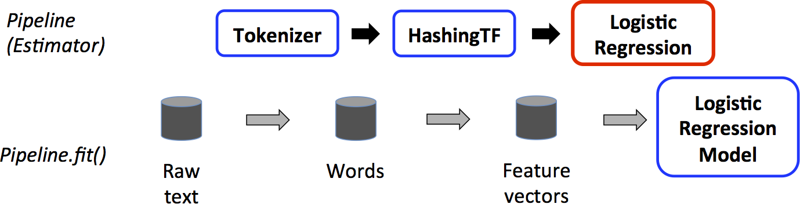
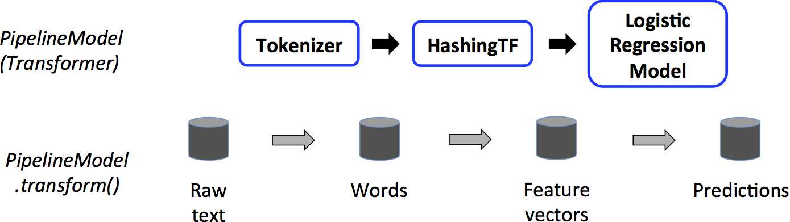

# 目录

[toc]

---

[source](https://spark.apache.org/docs/1.2.2/ml-guide.html)

`spark.ml` 包目标是提供统一的高级别的 API ，这些高级 API 建立在 DataFrame 上， 
DataFrame 帮助用户 **创建和调整实用的机器学习管道**。
在下面 `spark.ml` 子包指导中查看的算法指导部分，包含管道 API 独有的特征转换器，集合等。

内容表：

- [Main concepts in Pipelines](https://link.zhihu.com/?target=http%3A//spark.apache.org/docs/1.6.2/ml-guide.html%23main-concepts-in-pipelines) ( 管道中的主要概念 )
  - [DataFrame](https://link.zhihu.com/?target=http%3A//spark.apache.org/docs/1.6.2/ml-guide.html%23dataframe)
    - [Pipeline components](https://link.zhihu.com/?target=http%3A//spark.apache.org/docs/1.6.2/ml-guide.html%23pipeline-components) ( 管道组件 )
    - [Transformers](https://link.zhihu.com/?target=http%3A//spark.apache.org/docs/1.6.2/ml-guide.html%23transformers) ( 转换器 )
    - [Estimators](https://link.zhihu.com/?target=http%3A//spark.apache.org/docs/1.6.2/ml-guide.html%23estimators) ( 评估器 )
    - [Properties of pipeline components](https://link.zhihu.com/?target=http%3A//spark.apache.org/docs/1.6.2/ml-guide.html%23properties-of-pipeline-components) ( 管道组件的属性 )
  
  - [Pipeline](https://link.zhihu.com/?target=http%3A//spark.apache.org/docs/1.6.2/ml-guide.html%23pipeline) （管道）
    - [How it works](https://link.zhihu.com/?target=http%3A//spark.apache.org/docs/1.6.2/ml-guide.html%23how-it-works) （怎样工作）
    - [Details]() （明细）
  - [Parameters]() （参数）
  - [Saving and Loading Pipelines]() （保存和加载管道）

- [Code examples]() （实例代码）
  - [Example: Estimator, Transformer, and Param]() （例： Estimator, Transformer, and Param ）
  - [Example: Pipeline]() （例：管道）
  - [Example: model selection via cross-validation]() （例：通过交叉校验选择模型）
  - [Example: model selection via train validation split]() （例：通过训练检验分离选择模型）

# Main concepts （主要概念）

对于机器学习算法 ， spark ML 标准化 API 很容易联合多个算法到同一个管道中，或者工作流中。这部分介绍 spark ML API 引入的主要的概念。管道概念是从 scikit-learn 中得到的很多启发。

> **ML Dataset**: Spark ML uses the SchemaRDD from Spark SQL as a dataset which can hold a variety of data types. 
> E.g., a dataset could have different columns storing text, feature vectors, true labels, and predictions.<br>
**Transformer**: A Transformer is an algorithm which can transform one SchemaRDD into another SchemaRDD. 
E.g., an ML model is a Transformer which transforms an RDD with features into an RDD with predictions.<br>
**Estimator**: An Estimator is an algorithm which can be fit on a SchemaRDD to produce a Transformer. E.g., a learning algorithm is an Estimator which trains on a dataset and produces a model.<br>
**Pipeline**: A Pipeline chains multiple Transformers and Estimators together to specify an ML workflow.<br>
**Param**: All Transformers and Estimators now share a common API for specifying parameters.

- **`DataFrame`** ： 这个 ML API 使用来自 Spark SQL 的 DataFrame 作为 ML 数据集，它可以容纳多种数据类型。
  例如，一个 DataFrame 可以有不同的列来存储文本、特征向量、真实标签和预测。<br><br>

- **`Transformer`** ： Transformer 是一种算法，可以**将一个 DataFrame 转换为另一个 DataFrame**。
  例如，ML 模型是一个 Transformer，它将具有特征的 DataFrame 转换为具有预测的 DataFrame。<br><br>

- **`Estimator`** ： Estimator 是一种算法，它 **`fit` 在一个 DataFrame 以生成一个 Transformer**。
  例如，学习算法是一个 Estimator，它在 DataFrame 上训练并生成模型。<br><br>

- **`Pipeline`** ： Pipeline 将多个 Transformer 和 Estimator 链接在一起以指定 ML 工作流程。<br><br>

- **`Param`** ： 所有 Transformer 和 Estimator 共享一个用于指定参数的通用 API。<br><br>


## ML Dataset (SchemaRDD)

**==(SchemaRDD 实际上就是 DataFrame)==**

机器学习可以应用于很多的数据类型上，如：向量，文本，图片，结构数据。 
ML 采用 [SchemaRDD](https://spark.apache.org/docs/1.2.2/api/scala/index.html#org.apache.spark.sql.SchemaRDD) 就是为了支持多种数据类型。

SchemaRDD 支持很多基本和结构化的类型；支持 [spark sql](https://spark.apache.org/docs/1.2.2/sql-programming-guide.html#spark-sql-datatype-reference) 里的类型，还有向量。

SchemaRDD 可以显性或隐性的从常规的 RDD 创建。 详见代码

SchemaRDD 中的列已经命名了。下面的实例代码中使用的名称 如 “ text, ” “ features, ” 和“ label. ”

---

## ML Algorithms

### Transformers 转换器

Transformers 是包含特征 transformers 和学习模型的抽象。
技术上，一个 Transformers 执行一个 **`transform()`** 方法 ==**转换 SchemaRDD**==. 一般是增加一个或多个列。

例：
- 一个特征转换器拿到一个 SchemaRDD, 读取一列映射到一个新列上。 然后输出一个包含映射列的新的 SchemaRDD.
- 一个学习模型拿到一个 SchemaRDD. 读取包含特征向量的列，为每个特征向量预测标签， 然后把预测标签作为一个新列放到 SchemaRDD 中输出。


### Estimators 评估器

Estimators 抽象一个应用或训练在数据上的算法的概念。
技术上， 评估器调用 **`fit()`** 方法接收一个 SchemaRDD 然后 ==**产生一个模型**==，这个模型就是转换器。
例： 
一个学习算法如逻辑回归是一个 Estimators ，调用 `fit()` 方法训练 `LogisticRegressionModel` ，
它是一个模型，因此是一个 transformer 。

### Properties of ML Algorithms

Transformer and Estimator 都是无状态的。将来，有状态算法可以通过替代概念来支持。

每一个 Transformer or Estimator 的实例都有一个 ==唯一 id==， 在指定参数时很有用（下面讨论）。

---

## Pipeline (工作流)

在机器学习中， 通常会运行一系列的算法去处理和学习数据。
例 : 一个简单的文本文档处理工作流可以包含一些 stage ：
- 把文档中的文本分成单词。
- 转换文档中的每个单词成为数字化的特征向量
- 使用特征向量和标签学习预测模型。

spark ML 描述一个工作流作为一个管道。
管道由一系列的 PipelineStage(Transformers 和 Estimators) 组成，以指定的顺序运行。
在这部分中我们将使用这个简单的工作流作为运行的例子

### How it works

一个管道被指定为一系列的阶段，每一阶段要么是 Transformer 或是 Estimator 。
这些 stage 有序运行，输入的 dataset 被它通过的每个 stage 转换。
对于 Transformer 阶段， `transform()` 方法在 dataset 调用，
对于 Estimator 阶段， `fit()` 方法被调用产生一个新的 Transformer( Transformer 变成 PipelineModel 的一部分，或合适的管道 ) ，
然后 Transformer 调用 transform() 方法应用在 dataset 上。

我们通过一个简单文本文档工作流来阐明， 下面的图是关于管道的 training time 的用法。



上面，顶行代表包含三个阶段的管道。
前两个蓝色的 (Tokenizer and HashingTF) 是转换器，第三个 LogisticRegression 是评估器。
底部的行代表通过管道的数据流，圆筒是 SchemaRDDs。 

Pipeline.fit() 方法在初始的 df 上调用，它是行文本和标签。 
Tokenizer.transform() 方法把行文本分成单词，增加一个包含单词的新列到 DF 上。
HashingTF.transform() 方法转换单词列成特征向量，增加一个包含向量的新列到 DF 上。
现在， LogisticRegression 是评估器，管道首先调用 LogisticRegression.fit() 生成 LogisticRegressionModel 。

如果管道有多个 stage（组成 DAG），在传递 df 给下一 stage 之前它调用 LogisticRegressionModel 的 transform() 方法。


==**一个 Pipeline 是一个 Estimators**，
因此，管道的 fit() 方法运行之后，产生一个 PipelineModel ，它是一个Estimators。==
这个 PipelineModel 使用在校验阶段（test time ）； 
下图说明了 PipelineModel 的用法。



在上图里， PipelineModel 与原管道的 stage 的数量相同。
但是在原始管道中所有的 Estimators 都变成 Transformer 。

当在测试数据集上调用 PipelineModel’s transform() 时，数据有序的通过合适的管道。
每一个 stage 的 transform() 更新数据集，然后传给下一个 stage 。

Pipeline 和 PipelineModel 有助于确保训练集和测试集得到相同的特征处理步骤。

### details 细节

DAG 管道： 一个管道里的多个 stage 被指定为一个有序的数组。
上面的例子给的是线性管道的例子，管道里的 stage 使用的数据是它上一个 stage 产生的。
也可以创建非线性的管道，只要数据流图是一个 DAG 图。 
DAG 图可以基于每个 stage 输入和输出的列名隐式的指定。
如果管道是 DAG 的形式，然后 stage 的拓扑图顺序必须被指定。

运行时检测：由于管道可以操作多类型的 DataFrame ，所以不能执行 **编译时类型** 检测。 
Pipelines 和 PipelineModel 在运行时检测。
==使用 DataFrame 的 **schema** 来做检测==。

独一无二的管道 stage ：管道的 stage 应该是独一无二实例 ，
举例：同一个 myHashing 实例不能插入管道两次，因为管道必须有唯一 id 。
然而，实例两个实例（ myHashingTF1 and myHashingTF2 ）可以放到同一个管道中， 因为**不同的实例产生不同的 id** 。

---

## Parameters 参数

ML 的 Estimator 和 Transformer 使用相同的 api 来指定参数。

参数名 [Param](https://spark.apache.org/docs/1.2.2/api/scala/index.html#org.apache.spark.ml.param.Param) 是一个参数， [ParamMap](https://spark.apache.org/docs/1.2.2/api/scala/index.html#org.apache.spark.ml.param.ParamMap) 是一个参数的集合 (parameter, value)

给算法传参的有两种主要的方法：

1. 为实例设置参数。例：如果 lr 是 LogisticRegression 的实例。设置 lr.setMaxIter(10) ，可以让 lr.fit() 最多十次迭代。这个 API 整合了 spark.mllib 包里的 api 。

2. 传递 ParamMap 给 `fit()` or `transform()` 方法。 ParamMap 里的参数将覆盖前面通过 setter 方法设定的参数。

Parameters 属于特定的 Estimators and Transformer 实例 ，
例：如果有两个逻辑回归 `lr1` and `lr2`, 然后可以创建包含两个 maxIter 参数的 ParamMap ： 
ParamMap(`lr1.maxIter` -> `10`, `lr2.maxIter` -> `20`) 。
如果在一个管道中两个算法都有 maxIter 参数时，这很有用。

---

## Code Examples


> This section gives code examples illustrating the functionality discussed above. 
> There is not yet documentation for specific algorithms in Spark ML. 
> For more info, please refer to the [API Documentation](https://spark.apache.org/docs/1.2.2/api/scala/index.html#org.apache.spark.ml.package). 
> Spark ML algorithms are currently wrappers for MLlib algorithms, and the [MLlib programming guide](https://spark.apache.org/docs/1.2.2/mllib-guide.html) has details on specific algorithms.

### Example: Estimator, Transformer, and Param

例子包含 Estimator, Transformer, and Param 的概念

```scala
import org.apache.spark.{SparkConf, SparkContext}
import org.apache.spark.ml.classification.LogisticRegression
import org.apache.spark.ml.param.ParamMap
import org.apache.spark.mllib.linalg.{Vector, Vectors}
import org.apache.spark.mllib.regression.LabeledPoint
import org.apache.spark.sql.{Row, SQLContext}

val conf = new SparkConf().setAppName("SimpleParamsExample")
val sc = new SparkContext(conf)
val sqlContext = new SQLContext(sc)

import sqlContext._

//准备带标签和特征的数据
// Prepare training data.
// We use LabeledPoint, which is a case class.  Spark SQL can convert RDDs of case classes
// into SchemaRDDs, where it uses the case class metadata to infer the schema.
val training = sparkContext.parallelize(Seq(
  LabeledPoint(1.0, Vectors.dense(0.0, 1.1, 0.1)),
  LabeledPoint(0.0, Vectors.dense(2.0, 1.0, -1.0)),
  LabeledPoint(0.0, Vectors.dense(2.0, 1.3, 1.0)),
  LabeledPoint(1.0, Vectors.dense(0.0, 1.2, -0.5))))

//创建一个逻辑回归实例，这个实例是评估器
// Create a LogisticRegression instance.  This instance is an Estimator.
val lr = new LogisticRegression()

// 输出参数等默认值
// Print out the parameters, documentation, and any default values.
println("LogisticRegression parameters:\n" + lr.explainParams() + "\n")

// 使用setter方法设置参数
// We may set parameters using setter methods.
lr.setMaxIter(10).setRegParam(0.01)

// 使用存储在lr中的参数来，学习一个模型，
// Learn a LogisticRegression model.  This uses the parameters stored in lr.
val model1 = lr.fit(training)

// 由于 model1 是一个模型，（也就是，一个评估器产生一个转换器），
// 我们可以看 lr 在 fit() 上使用的参数。
// 输出这些参数对，参数里的 names 是逻辑回归实例的唯一 id
// Since model1 is a Model (i.e., a Transformer produced by an Estimator),
// we can view the parameters it used during fit().
// This prints the parameter (name: value) pairs, where names are unique IDs for this
// LogisticRegression instance.
println("Model 1 was fit using parameters: " + model1.fittingParamMap)

// 我们可以使用 paramMap 选择指定的参数，并且提供了很多方法来设置参数
// We may alternatively specify parameters using a ParamMap,
// which supports several methods for specifying parameters.
val paramMap = ParamMap(lr.maxIter -> 20)
paramMap.put(lr.maxIter, 30) // Specify 1 Param.  This overwrites the original maxIter.
paramMap.put(lr.regParam -> 0.1, lr.threshold -> 0.5) // Specify multiple Params.

// One can also combine ParamMaps.
val paramMap2 = ParamMap(lr.scoreCol -> "probability") // Changes output column name.
val paramMapCombined = paramMap ++ paramMap2

// 使用新的参数学习模型
// Now learn a new model using the paramMapCombined parameters.
// paramMapCombined overrides all parameters set earlier via lr.set* methods.
val model2 = lr.fit(training, paramMapCombined)
println("Model 2 was fit using parameters: " + model2.fittingParamMap)

// 准备测试数据
// Prepare test documents.
val test = sparkContext.parallelize(Seq(
  LabeledPoint(1.0, Vectors.dense(-1.0, 1.5, 1.3)),
  LabeledPoint(0.0, Vectors.dense(3.0, 2.0, -0.1)),
  LabeledPoint(1.0, Vectors.dense(0.0, 2.2, -1.5))))

// 使用转换器的 transform() 方法在测试数据上作出预测 .
// 逻辑回归的 transform 方法只使用“特征”列 .
// 注意 model2.transform() 方法输出的是 myProbability 列而不是 probability 列，因为在上面重命名了 lr.probabilityCol 参数。
// Make predictions on test documents using the Transformer.transform() method.
// LogisticRegression.transform will only use the 'features' column.
// Note that model2.transform() outputs a 'probability' column instead of the usual 'score'
// column since we renamed the lr.scoreCol parameter previously.
model2.transform(test)
  .select('features, 'label, 'probability, 'prediction)
  .collect()
  .foreach { case Row(features: Vector, label: Double, prob: Double, prediction: Double) =>
    println("(" + features + ", " + label + ") -> prob=" + prob + ", prediction=" + prediction)
  }
```

### Example: Pipeline

This example follows the simple text document Pipeline illustrated in the figures above.

```scala
import org.apache.spark.{SparkConf, SparkContext}
import org.apache.spark.ml.Pipeline
import org.apache.spark.ml.classification.LogisticRegression
import org.apache.spark.ml.feature.{HashingTF, Tokenizer}
import org.apache.spark.sql.{Row, SQLContext}

// Labeled and unlabeled instance types.
// Spark SQL can infer schema from case classes.
case class LabeledDocument(id: Long, text: String, label: Double)
case class Document(id: Long, text: String)

// Set up contexts.  Import implicit conversions to SchemaRDD from sqlContext.
val conf = new SparkConf().setAppName("SimpleTextClassificationPipeline")
val sc = new SparkContext(conf)
val sqlContext = new SQLContext(sc)
import sqlContext._

// 准备标记好的数据
// Prepare training documents, which are labeled.
val training = sparkContext.parallelize(Seq(
  LabeledDocument(0L, "a b c d e spark", 1.0),
  LabeledDocument(1L, "b d", 0.0),
  LabeledDocument(2L, "spark f g h", 1.0),
  LabeledDocument(3L, "hadoop mapreduce", 0.0)))

// 配置ML管道，由三个stage组成，tokenizer, hashingTF, and lr
// Configure an ML pipeline, which consists of three stages: tokenizer, hashingTF, and lr.
val tokenizer = new Tokenizer()
  .setInputCol("text")
  .setOutputCol("words")

val hashingTF = new HashingTF()
  .setNumFeatures(1000)
  .setInputCol(tokenizer.getOutputCol)
  .setOutputCol("features")

val lr = new LogisticRegression()
  .setMaxIter(10)
  .setRegParam(0.01)

val pipeline = new Pipeline()
  .setStages(Array(tokenizer, hashingTF, lr))

// Fit 管道到数据上
// Fit the pipeline to training documents.
val model = pipeline.fit(training)

// 测试数据，未标记
// Prepare test documents, which are unlabeled.
val test = sparkContext.parallelize(Seq(
  Document(4L, "spark i j k"),
  Document(5L, "l m n"),
  Document(6L, "mapreduce spark"),
  Document(7L, "apache hadoop")))

// 使用测试数据进行预测
// Make predictions on test documents.
model.transform(test)
  .select('id, 'text, 'score, 'prediction)
  .collect()
  .foreach { case Row(id: Long, text: String, score: Double, prediction: Double) =>
    println("(" + id + ", " + text + ") --> score=" + score + ", prediction=" + prediction)
  }
```

### Example: model selection via cross-validation 通过交叉验证选择模型

在机器学习中一个重要的任务是模型选择，或使用数据发现最好的模型或给任务设置参数，这叫做调优。
通过调优整个管道去促进管道选择模型会变的容易， 而不是分开的调优管道内的每一个元素。

当前， spark.ml 支持使用交叉验证器

CrossValidator
类选择模型，这个类接收一个 Estimator ，一个参数集，一个 Evaluator ， CrossValidator 开始拆分数据集到一个 fold 集中，这个 fold 集被用来作为分开测试和训练的数据集； 例：带有 3 个 fold 的 CrossValidator 将产生 3 组（训练，测试）数据集，每一个数据集中 2/3 作为训练数据， 1/3 作为测试数据 . CrossValidator 通过参数集进行迭代计算。为每一个 ParamMap ，训练给定的 Estimator 并且使用给予的 Evaluator 来评估。

RegressionEvaluator
评估器 Evaluator 来评估回归问题，

BinaryClassificationEvaluator
来评估二元数据，

MultiClassClassificationEvaluator
评估多元分类问题。

用于选择最佳 paraMap 参数的默认度量可以被 Evaluator 的 setMetric 方法覆盖。

产生最好评估度量的 paramMap 被选择作为最好的模型。 CrossValidator 最终使用最好的 paramMap 和整个数据集 fit 评估器，（意思就是执行评估器的 fit 方法）

下面的例子就是 CrossValidator 从一个网格参数做选择。只用

ParamGridBuilder
工具构造参数网格。

注意在一个网格参数上做交叉校验是非常昂贵的。例，下面的例子中， hashingTF.numFeatures 有 3 个值和 lr.regParam 有 2 个值的参数网络，并且 CrossValidator 的 fold 是 2 个。这个相乘的输出是 (3 2) 2=12 不同的明细需要训练，在真实的设置中，参数会被设置的更大并且有更多的 fold （一般是 3 或者 10 ）。换句话说。使用 CorssValidator 是非常昂贵的。

然而，用来选择参数它也是一个行之有效的方法。

```scala
import org.apache.spark.{SparkConf, SparkContext}
import org.apache.spark.SparkContext._
import org.apache.spark.ml.Pipeline
import org.apache.spark.ml.classification.LogisticRegression
import org.apache.spark.ml.evaluation.BinaryClassificationEvaluator
import org.apache.spark.ml.feature.{HashingTF, Tokenizer}
import org.apache.spark.ml.tuning.{ParamGridBuilder, CrossValidator}
import org.apache.spark.sql.{Row, SQLContext}

val conf = new SparkConf().setAppName("CrossValidatorExample")
val sc = new SparkContext(conf)
val sqlContext = new SQLContext(sc)
import sqlContext._

// Prepare training documents, which are labeled.
val training = sparkContext.parallelize(Seq(
  LabeledDocument(0L, "a b c d e spark", 1.0),
  LabeledDocument(1L, "b d", 0.0),
  LabeledDocument(2L, "spark f g h", 1.0),
  LabeledDocument(3L, "hadoop mapreduce", 0.0),
  LabeledDocument(4L, "b spark who", 1.0),
  LabeledDocument(5L, "g d a y", 0.0),
  LabeledDocument(6L, "spark fly", 1.0),
  LabeledDocument(7L, "was mapreduce", 0.0),
  LabeledDocument(8L, "e spark program", 1.0),
  LabeledDocument(9L, "a e c l", 0.0),
  LabeledDocument(10L, "spark compile", 1.0),
  LabeledDocument(11L, "hadoop software", 0.0)))

// 配置机器学习管道，由 tokenizer, hashingTF,  lr 评估器 组成
// Configure an ML pipeline, which consists of three stages: tokenizer, hashingTF, and lr.
val tokenizer = new Tokenizer()
  .setInputCol("text")
  .setOutputCol("words")
val hashingTF = new HashingTF()
  .setInputCol(tokenizer.getOutputCol)
  .setOutputCol("features")
val lr = new LogisticRegression()
  .setMaxIter(10)
val pipeline = new Pipeline()
  .setStages(Array(tokenizer, hashingTF, lr))

// We now treat the Pipeline as an Estimator, wrapping it in a CrossValidator instance.
// This will allow us to jointly choose parameters for all Pipeline stages.
// A CrossValidator requires an Estimator, a set of Estimator ParamMaps, and an Evaluator.
val crossval = new CrossValidator()
  .setEstimator(pipeline)
  .setEvaluator(new BinaryClassificationEvaluator)

// 使用 ParamGridBuilder 构造一个参数网格，
// hashingTF.numFeatures 有 3 个值， lr.regParam 有 2 个值，
// 这个网格有 6 个参数给 CrossValidator 来选择
// We use a ParamGridBuilder to construct a grid of parameters to search over.
// With 3 values for hashingTF.numFeatures and 2 values for lr.regParam,
// this grid will have 3 x 2 = 6 parameter settings for CrossValidator to choose from.
val paramGrid = new ParamGridBuilder()
  .addGrid(hashingTF.numFeatures, Array(10, 100, 1000))
  .addGrid(lr.regParam, Array(0.1, 0.01))
  .build()

// 现在我们把管道看做成一个 Estimator ，把它包装到 CrossValidator 实例中。
// 这可以让我们连带的为管道的所有 stage 选择参数。
// CrossValidator 需要一个 Estimator ，一个评估器参数集合，和一个 Evaluator 。
// 注意这里的 evaluator 是二元分类的 BinaryClassificationEvaluator ，它默认的度量是 areaUnderROC.
crossval.setEstimatorParamMaps(paramGrid)
crossval.setNumFolds(2) // Use 3+ in practice 在实战中使用 3+

// Run cross-validation, and choose the best set of parameters.
val cvModel = crossval.fit(training)
// Get the best LogisticRegression model (with the best set of parameters from paramGrid).
val lrModel = cvModel.bestModel

// Prepare test documents, which are unlabeled.
val test = sparkContext.parallelize(Seq(
  Document(4L, "spark i j k"),
  Document(5L, "l m n"),
  Document(6L, "mapreduce spark"),
  Document(7L, "apache hadoop")))

// 在测试文档上做预测，cvModel 是选择出来的最好的模型
// Make predictions on test documents. cvModel uses the best model found (lrModel).
cvModel.transform(test)
  .select('id, 'text, 'score, 'prediction)
  .collect()
  .foreach { case Row(id: Long, text: String, score: Double, prediction: Double) =>
  println("(" + id + ", " + text + ") --> score=" + score + ", prediction=" + prediction)
}
```

### Example: model selection via train validation split 例：通过训练校验分离来模型选择


除了 CrossValidator 以外 spark 还提供 TrainValidationSplit 来进行超 - 参数调优。
TrainValidationSplit 只评估每一种参数组合一次。
而不是像 CrossValidator 评估 k 次， TrainValidationSplit 只有一次。
因此不是很昂贵，但是如果训练数据集不够大就不能产生能信赖的结果。

TrainValidationSplit 需要传入一个 Estimator, 一个包含 estimatorParamMaps 参数的 paraMap 的集和一个 Evaluator 。
它一开始使用 trainRatio 参数值把数据集分成训练数据和测试数据两个部分。
例如： 
使用 **`trainRatio=0.75`** （默认值）， TrainValidationSplit 就产生 75% 数据用于训练， 25% 的数据用于测试。
与 CrossValidator 相似的是， TrainValidationSplit 也是通过迭代参数集 paramMap 。

对于每一种参数组合，使用给定的 Estimator 训练，在给定 Evaluator 上评估。
产生最好的评估度量的 paramMap 作为最好的选择。 
TrainValidationSplit 最终会使用最好的参数和整个数据集条用 Estimator 的 fit 方法。


```scala
import org.apache.spark.ml.evaluation.RegressionEvaluator
import org.apache.spark.ml.regression.LinearRegression
import org.apache.spark.ml.tuning.{ParamGridBuilder, TrainValidationSplit}

// Prepare training and test data.
// 准备训练数据和测试数据
val data = sqlContext.read.format("libsvm").load("data/mllib/sample_linear_regression_data.txt")
val Array(training, test) = data.randomSplit(Array(0.9, 0.1), seed = 12345)

val lr = new LinearRegression()

// We use a ParamGridBuilder to construct a grid of parameters to search over.
// TrainValidationSplit will try all combinations of values and determine best model using
// the evaluator.
// ParamGridBuilder构建一组参数
// TrainValidationSplit将尝试从这些所有值的组合中使用evaluator选出最好的模型
val paramGrid = new ParamGridBuilder()
  .addGrid(lr.regParam, Array(0.1, 0.01))
  .addGrid(lr.fitIntercept)
  .addGrid(lr.elasticNetParam, Array(0.0, 0.5, 1.0))
  .build()

// In this case the estimator is simply the linear regression.
// A TrainValidationSplit requires an Estimator, a set of Estimator ParamMaps, and an Evaluator.
// 在这里estimator是简单的线性回归
// TrainValidationSplit 需要一个Estimator ， 一个Estimator ParamMaps集，一个Evaluator
val trainValidationSplit = new TrainValidationSplit()
  .setEstimator(lr)
  .setEvaluator(new RegressionEvaluator)
  .setEstimatorParamMaps(paramGrid)
  // 80% of the data will be used for training and the remaining 20% for validation.
  // 80%数据作为训练，剩下的20%作为验证
  .setTrainRatio(0.8)

// Run train validation split, and choose the best set of parameters.
// 运行训练校验分离，选择最好的参数。
val model = trainValidationSplit.fit(training)

// Make predictions on test data. model is the model with combination of parameters
// that performed best.
// 在测试数据上做预测，模型是参数组合中执行最好的一个
model.transform(test)
  .select("features", "label", "prediction")
  .show()
```

---

[参考文章](https://zhuanlan.zhihu.com/p/24649048)


<br>
<br><br><br><br><br><br>


<u></u>

<!-- 
</img>
</img>
 -->


<style>
html body {
	body {
    font-family: -apple-system,BlinkMacSystemFont,Helvetica Neue,PingFang SC,Microsoft YaHei,Source Han Sans SC,Noto Sans CJK SC,WenQuanYi Micro Hei,sans-serif !important;
}
}
.red {
	color: red;
	font-weight: bold;
}
.blue {
	color: blue;
	font-weight: bold;
}
html body blockquote {
	font-family: consolas !important;
	font-size: 14px
}

</style>


