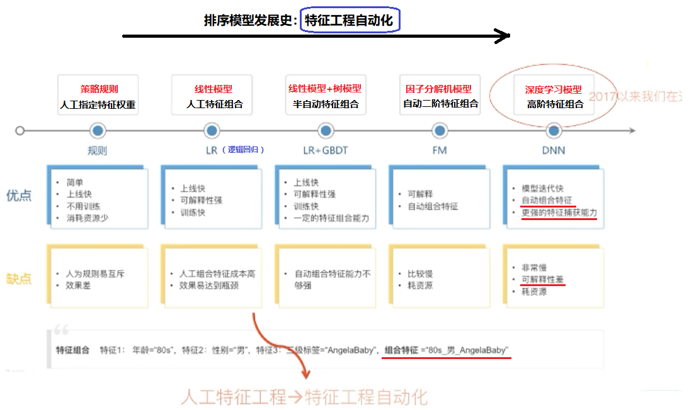

# 目录

[toc]

---

[source]()

DCN: 高效生成固定阶数的交叉特征

# 1、背景介绍

[link](https://www.bilibili.com/video/BV1j64y1F7NY?from=search&seid=7521781198163652584&spm_id_from=333.337.0.0&t=2m7s)

- <blue>传统方法</blue>

需要手动进行特征工程或暴力搜索，成本高代价大。

- <blue>本文方法（DCN）</blue>

**==高效生成固定阶数的交又特征==**，成本低代价小。

# 2、相关工作

## 2.1 广告部分基本流程

[link](https://www.bilibili.com/video/BV1j64y1F7NY?from=search&seid=7521781198163652584&spm_id_from=333.337.0.0&t=3m7s)

### 2.1.1 广告平台

[link](https://www.bilibili.com/video/BV1j64y1F7NY?from=search&seid=7521781198163652584&spm_id_from=333.337.0.0&t=3m6s)

- 1、召回匹配
- 2、推荐排序
- 3、广告展示

</img>

</img>

### 2.1.2 CTR

CTR (**click-through-rate**) 即 ==**点击通过率**==，
是互联网广告常用的术语，
指网络广告（图片广告/文字广告/关键词广告/排名广告/视频广告等）的点击到达率，
即该 ==**广告的实际点击次数除以广告的展现量**==（Show content)。
例如：
**我们经过推荐系统计算过后展示给用户的广告为 5 条，用户点击了其中一条，那么 CTR 就是 1/5**

### 2.1.3 工业界 CTR 模型的演化历史

[link](https://www.bilibili.com/video/BV1j64y1F7NY?from=search&seid=7521781198163652584&spm_id_from=333.337.0.0&t=6m27s)
**==特征工程及特征组合的自动化==**，一直是推动实用化推荐系统技术演进最主要的方向

### 2.1.4 广告特征
[link](https://www.bilibili.com/video/BV1j64y1F7NY?from=search&seid=7521781198163652584&spm_id_from=333.337.0.0&t=11m33s)
特征主要有四部分组成
- 用户画像特征 (user profile)
- 用户行为特征 (user behavior)
- 广告特征 (ad)
- 上下文特征 (context)

特征特点：**高维、稀疏、多 field**

 
            

<u></u>

<!-- 
</img>
</img>
 -->

