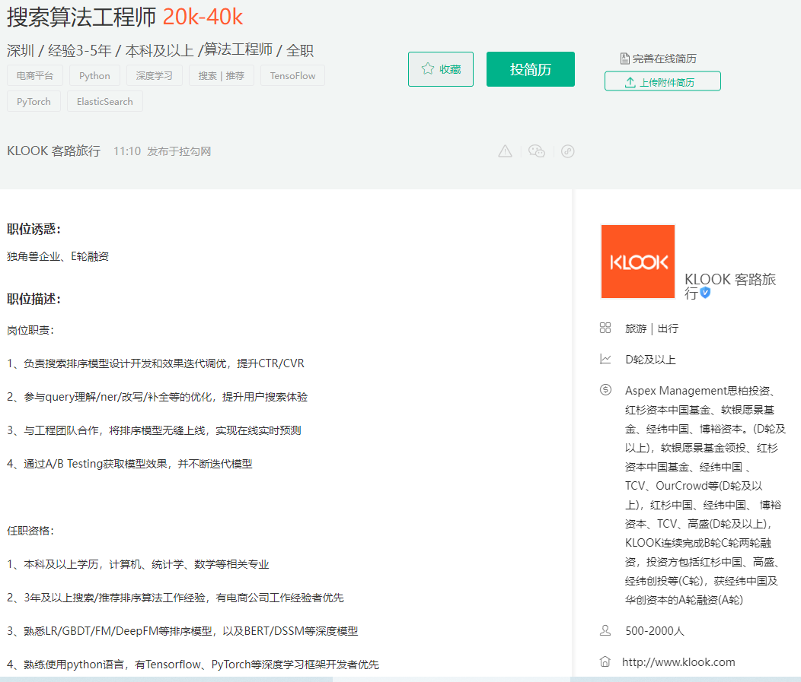

职位描述：
岗位职责：
1、负责保险产品个性化推荐、内容资讯推荐等业务系统的架构和策略研发工作；
2、负责特征建设、模型构建、推荐策略的研发工作；
3、负责机器学习算法的在线工程化、离线训练平台的研发工作。

任职资格：
1、计算机或相关专业本科以上学历，硕士优先；
2、三年及以上工作经验；
3、熟悉python、shell等语言；熟悉hadoop、spark等常用的大数据处理平台；有Golang开发经验者优先考虑；
4、熟悉机器学习等方向的基础理论，熟悉CF/LR/FM/GBDT/DNN等常见机器学习工具，熟悉W&D/DeepFM/FTRL等深度学习模型；
5、熟练掌握基本的召回和排序算法，有特征工程、画像建设，排序优化等方面经验，有大规模工业推荐系统场景优化经验优先；
6、积极主动、责任心强。

---

职位描述：
岗位职责：

1、负责搜索排序模型设计开发和效果迭代调优，提升CTR/CVR

2、参与query理解/ner/改写/补全等的优化，提升用户搜索体验

3、与工程团队合作，将排序模型无缝上线，实现在线实时预测

4、通过A/B Testing获取模型效果，并不断迭代模型

任职资格：

1、本科及以上学历，计算机、统计学、数学等相关专业

2、3年及以上搜索/推荐排序算法工作经验，有电商公司工作经验者优先

3、熟悉LR/GBDT/FM/DeepFM等排序模型，以及BERT/DSSM等深度模型

4、熟练使用python语言，有Tensorflow、PyTorch等深度学习框架开发者优先

5、了解A/B Testing过程，熟悉CTR、CVR、UV value等指标

6、具有良好的沟通能力，英语听力良好

