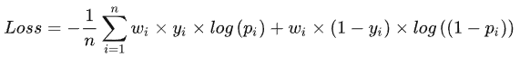

# 目录

[toc]

---

[source](https://zhuanlan.zhihu.com/p/291406172)

# 多目标学习在推荐系统的应用(MMOE/ESMM/PLE)

# 一、前言
最近搞了一个月的视频多目标优化，
同时优化点击率和衍生率 (ysl, 点击后进入第二个页面后续的点击次数)，
线上 AB 实验取得了不错的效果，总结一下优化的过程，更多的偏向实践。

# 二、业界方案

## 2.1 样本 Loss 加权

**保证一个主目标的同时，将其它目标转化为 ==样本权重==**，改变数据分布，达到优化其它目标的效果。

如果 $y_i = 0$ ,则 $w_i = 1$ .

**优点**：
模型简单，仅在训练时通过梯度乘以样本权重实现对其它目标的加权
模型上线简单，和 base 完全相同，不需要额外开销
在主目标没有明显下降时，其它目标提升较大
(线上AB测试，主目标点击降低了1.5%，而衍生率提升了5%以上)

**缺点**：
本质上并不是多目标建模，而是将不同的目标转化为同一个目标。
样本的加权权重需要根据 AB 测试才能确定。

## 2.2 多任务学习 Shared-Bottom Multi-task Model

模型结构如图1所示：

</img>

Shared-Bottom 网络通常位于底部，表示为函数 $f$ ，多个任务共用这一层。
往上，$K$  个子任务分别对应一个 tower network，表示为 $h^k$ ，
每个子任务的输出为：$y^k = h^k(f(x))$

**优点：**
浅层参数共享，互相补充学习，**任务相关性越高，模型的 loss 可以降低到更低**
**缺点：**
任务没有好的相关性时，这种 Hard parameter sharing 会损害效果

## 2.3 多任务学习-MOE

模型结构如图 2 所示：
</img>

 
      

<u></u>

<!-- 
</img>
</img>
 -->

