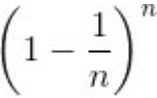
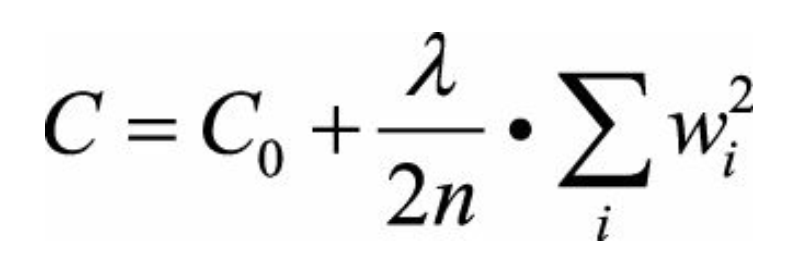

# 目录

[toc]

----

# 第2章 模型评估

## 04 A/B测试的陷阱

H 公司的算法工程师们最近 **针对系统中的“美国用户” 研发了一套全新的视频推荐模型 A** ， 
而 **目前正在使用的针对全体用户的推荐模型是 B** 。
在正式上线之前， 工程师们希望通过 A/B 测试来验证新推荐模型的效果。
**将用户划分为实验组和对照组，对实验组施以推荐模型 A ， 对照组施以推荐模型 B**
下面有三种实验组和对照组的划分方法， 请指出哪种划分方法是正确的？
- (1) 根据 **user_id (user_id 完全随机生成） 个位数的奇偶性** 划分为实验组和对照组；
- (2) 将 **user_id 个位数为奇数且为美国用户的** 作为实验组， 其余用户为对照组；
- (3) 将 **user_id 个位数为奇数且为美国用户** 的作为实验组， **user_id 个位数为偶数的用户**作为对照组。

分析与解答:
上述 3 种 A/B 测试的划分方法都不正确。我们用包含关系图来说明三种划分方法， 
如图 2.4 所示。

- 方法 1 （见图 2.4 (a)) 没有区分是否为美国用户， 实验组和对照组的实验结果均有 ew 稀释； 

- 方法 2 （见图 2.4 (b)) 的实验组选取无误， 并将其余所有用户划分为对照组， 导致 **对照组的结果被稀释**； 

- 方法 3 （见图 2.4 (c)) 的对照组存在偏差。

正确的做法是将 **==所有美国用户==** 根据 user_id 个位数划分为试验组合对照组（见图 2.4 (d)) ， 
分别施以模型 A 和 B ， 才能够验证模型 A 的效果。

 

## 05 模型评估的方法
场景描述
在机器学习中，我们通常把样本分为 **训练集** 和 **测试集**，
训练集用于训练模型，测试集用于评估模型。

在样本划分和模型验证的过程中，存在着不同的 **抽样方法** 和 **验证方法**。
本小节主要考察面试者是否熟知这些方法及其优缺点、是否能够在不同问题中挑选合适的评估方法。

知识点
Holdout检验，交叉验证，自助法（Bootstrap），微积分

<red>面试问题1： 在模型评估过程中，有哪些主要的验证方法，它们的优缺点是什么?</red>

分析与解答

**①、Holdout 检验**
Holdout 检验是最简单也是最直接的验证方法，
**将原始的样本集合 ==随机== 划分成训练集和验证集两部分**。
比方说，
对于一个点击率预测模型，我们把样本按照70% 30% 的比例分成两部分， 
70% 的样本用于模型训练； 
30% 的样本用于模型验证，包括绘制 ROC 曲线、计算精确率和召回率等指标来评估模型性能。
Holdout 检验的缺点很明显，
即 **在验证集上计算出来的最后评估指标与原始分组有很大关系**。

为了消除随机性，研究者们引入了“交叉检验”的思想。

**②、交叉检验**
1. **k-fold 交叉验证**：
首先将全部样本划分成 k 个大小相等的样本子集；
依次遍历这 k 个子集，**每次把当前子集作为验证集，其余所有子集作为训练集**，进行模型的训练和评估；
最后把 k 次评估指标的平均值作为最终的评估指标。在实际实验中， k 经常取 10 。

2. **留一验证**：
**每次留下 1 个样本作为验证集，其余所有样本作为测试集**。
样本总数为 n ，依次对 n 个样本进行遍历，进行 n 次验证，
再将评估指标求平均值得到最终的评估指标。
**在样本总数较多的情况下，留一验证法的时间开销极大**。
事实上，留一验证是留 p 验证的特例。
留 p 验证是每次留下 p 个样本作为验证集，而从 n 个元素中选择 p 个元素有种可能，
因此它的时间开销更是远远高于留一验证，故而很少在实际工程中被应用。

**③、自助法**
不管是 Holdout 检验还是交叉检验，都是基于划分训练集和测试集的方法进行模型评估的。
然而，当样本规模比较小时，将样本集进行划分会让训练集进一步减小，这可能会影响模型训练效果。
有没有能维持训练集样本规模的验证方法呢？自助法可以比较好地解决这个问题。
自助法是基于自助采样法的检验方法。
对于总数为 n 的样本集合，进行 n 次有放回的随机抽样，得到大小为 n 的训练集。 
**n 次采样过程中，有的样本会被重复采样，有的样本没有被抽出过，
将这些没有被抽出的样本作为验证集，进行模型验证，这就是自助法的验证过程**。
 

<red>面试问题 2： 在自助法的采样过程中，对 n 个样本进行 n 次自助抽样，
当 n 趋于无穷大时，最终有多少数据从未被选择过？</red>

一个样本在一次抽样过程中未被抽中的概率为  ，n次抽样均未抽中的概率为 。 
当n趋于无穷大时， 概率为 。
根据重要极限， ，所以有：

因此， 当样本数很大时，大约有 36.8% 的样本从未被选择过，可作为验证集。

 

## 06 超参数调优
场景描述
对于很多算法工程师来说，超参数调优是件非常头疼的事。
**除了根据经验设定所谓的 “合理值” 之外，一般很难找到合理的方法去寻找超参数的最优取值。**
而与此同时，超参数对于模型效果的影响又至关重要。
有没有一些可行的办法去进行超参数的调优呢？

<red>面试问题：超参数有哪些调优方法？</red>

为了进行超参数调优，我们一般会采用网格搜索、随机搜索、贝叶斯优化等算法。
在具体介绍算法之前，需要明确超参数搜索算法一般包括哪几个要素。
1. **目标函数**，即算法 ==需要最大化 / 最小化的目标（**调参要达到的效果**）==；
2. **搜索范围**，一般通过上限和下限来确定；
3. **算法的其他参数**，如搜索步长。

<hlight>网格搜索</hlight>
网格搜索可能是最简单、应用最广泛的超参数搜索算法，
它通过查找搜索范围内的所有的点来确定最优值。
如果采用较大的搜索范围以及较小的步长，网格搜索有很大概率找到全局最优值。
然而，这种搜索方案十分消耗计算资源和时间，特别是需要调优的超参数比较多的时候。
因此，在实际应用中，
**网格搜索法一般会先使用较广的搜索范围和较大的步长，来寻找全局最优值可能的位置；
然后会逐渐缩小搜索范围和步长，来寻找更精确的最优值。**
这种操作方案可以降低所需的时间和计算量，
但由于目标函数一般是非凸的，所以很可能会错过全局最优值。

<hlight>随机搜索</hlight>
随机搜索的思想与网格搜索比较相似，
只是**不再测试上界和下界之间的所有值，而是在搜索范围中随机选取样本点**。
它的理论依据是，如果样本点集足够大，那么通过随机采样也能大概率地找到全局最优值，或其近似值。
随机搜索一般会比网格搜索要快一些，
但是和网格搜索的快速版一样，它的结果也是没法保证的。

<hlight>贝叶斯优化算法</hlight>
贝叶斯优化算法在寻找最优最值参数时，采用了与网格搜索、随机搜索完全不同的方法。
网格搜索和随机搜索在测试一个新点时，会忽略前一个点的信息；
而贝叶斯优化算法则充分利用了之前的信息。
**贝叶斯优化算法通过对目标函数形状进行学习，找到使目标函数向全局最优值提升的参数。**
具体来说，
**它学习目标函数形状的方法是，首先根据先验分布，假设一个搜集函数；
然后，每一次使用新的采样点来测试目标函数时，利用这个信息来更新目标函数的先验分布；
最后，算法测试由后验分布给出的全局最值最可能出现的位置的点。**
对于贝叶斯优化算法，有一个需要注意的地方，
<u>一旦找到了一个局部最优值，它会在该区域不断采样，所以很容易陷入局部最优值</u>。
为了弥补这个缺陷，贝叶斯优化算法会在探索和利用之间找到一个平衡点，
“**探索**” 就是 <u>在还未取样的区域获取采样点</u>；
“**利用**” 则是 <u>根据后验分布在最可能出现全局最值的区域进行采样</u>。

 

## 07 过拟合与欠拟合
场景描述
在模型评估与调整的过程中，我们往往会遇到“过拟合”或“欠拟合”的情况。
如何有效地识别“过拟合”和“欠拟合”现象，并有针对性地进行模型调整，是不断改进机器学习模型的关键。
特别是在实际项目中，
采用多种方法、从多个角度降低“过拟合”和“欠拟合”的风险是算法工程师应当具备的领域知识。

知识点 过拟合，欠拟合

- **问题 1 在模型评估过程中，过拟合和欠拟合具体是指什么现象？**

<hlight>过拟合</hlight> 是指模型对于训练数据拟合呈过当的情况，**模型在训练集上的表现很好，但在测试集和新数据上的表现较差。**
<hlight>欠拟合</hlight> 指的是 **模型在训练和预测时表现都不好的情况**。

图 2.5 形象地描述了过拟合和欠拟合的区别。

图 2.5（a）是 **欠拟合** 的情况，拟合的黄线没有很好地捕捉到数据的特征，不能够很好地拟合数据。
图 2.5（c）是 **过拟合** 的情况，**模型过于复杂，==把噪声数据的特征也学习到模型中==，导致模型泛化能力下降**，
在后期应用过程中很容易输出错误的预测结果

<red>面试问题 2 能否说出几种降低过拟合和欠拟合风险的方法？</red>

<hlight>降低“过拟合”风险的方法</hlight>
（ 1 ）**从数据入手，获得更多的训练数据**。使用更多的训练数据是解决过拟合问题最有效的手段，
因为更多的样本能够让模型学习到更多更有效的特征，减小噪声的影响。
当然，直接增加实验数据一般是很困难的，
但是==可以通过一定的规则来扩充训练数据==。
比如，在图像分类的问题上，可以==通过图像的平移、旋转、缩放等方式扩充数据==；
更进一步地，可以==使用生成式对抗网络来合成大量的新训练数据==。

（ 2 ）**降低模型复杂度**。在数据较少时，模型过于复杂是产生过拟合的主要因素，
适当降低模型复杂度可以避免模型拟合过多的采样噪声。
例如，在神经网络模型中减少网络层数、神经元个数等；在决策树模型中降低树的深度、进行剪枝等。

（ 3 ）**正则化方法**。给模型的参数加上一定的正则约束，
比如将权值的大小加入到损失函数中。以 L2 正则化为例：

这样，在优化原来的目标函数 C0 的同时，也能避免权值过大带来的过拟合风险。

（ 4 ）**集成学习方法**。集成学习是把多个模型集成在一起，来降低单一模型的过拟合风险，
如 Bagging 方法。

<hlight>降低“欠拟合”风险的方法</hlight>
（ 1 ）**添加新特征**。当 ==特征不足== 或者 ==现有特征与样本标签的相关性不强== 时，模型容易出现欠拟合。
通过挖掘“上下文特征”“ ID 类特征”“组合特征”等新的特征，往往能够取得更好的效果。
在深度学习潮流中，有很多模型可以帮助完成特征工程，
如因子分解机、梯度提升决策树、 Deep-crossing 等都可以成为丰富特征的方法。
（ 2 ）**增加模型复杂度**。简单模型的学习能力较差，通过增加模型的复杂度可以使模型拥有更强的拟合能力。
例如，在线性模型中添加高次项，在神经网络模型中增加网络层数或神经元个数等。
（ 3 ）**减小正则化系数**。
正则化是用来防止过拟合的，但当模型出现欠拟合现象时，则需要有针对性地减小正则化系数

---

# 第3章 经典算法

## TODO

---

# 第4章 降维

## TODO

---

# 第5章 非监督学习

## TODO

---

# 第6章 概率图模型

## TODO

---

# 第7章 优化算法

优化是应用数学的一个分支，也是机器学习的核心组成部分。
实际上，**机器学习算法 = 模型表征 + 模型评估 + 优化算法**。
其中，优化算法所做的事情就是在模型表征空间中找到模型评估指标最好的模型。

不同的优化算法对应的模型表征和评估指标不尽相同，
比如：
经典的支持向量机对应的模型表征和评估指标分别为线性分类模型和最大间隔，
逻辑回归对应的模型表征和评估指标则分别为线性分类模型和交叉熵。

随着大数据和深度学习的迅猛发展，在实际应用中面临的大多是大规模、高度非凸的优化问题，
这给传统的基于全量数据、凸优化的优化理论带来了巨大的挑战。
如何设计适用于新场景的、高效的、准确的优化算法成为近年来的研究热点。
优化虽然是一门古老的学科，
但是大部分能够用于训练深度神经网络的优化算法都是近几年才被提出，如 Adam 算法等。
虽然，目前大部分机器学习的工具已经内置了常用的优化算法，实际应用时只需要一行代码即可完成调用。
但是，鉴于优化算法在机器学习中的重要作用，了解优化算法的原理也很有必要

## 01 有监督学习的损失函数
场景描述
机器学习算法的关键一环是模型评估，而 **损失函数定义了模型的评估指标**。
可以说，没有损失函数就无法求解模型参数。
不同的损失函数优化难度不同，最终得到的模型参数也不同，
针对具体的问题需要选取合适的损失函数。

**知识点 损失函数**

<red>面试问题：有监督学习涉及的损失函数有哪些？请列举并简述它们的特点。</red>

分析与解答
在有监督学习中，损失函数刻画了模型和训练样本的匹配程度。
假设训练样本的形式为 $(x_i, y_i)$ ，其中 $x_i \in X$ 表示第 i 个样本点的特征， $y_i \in Y$ 表示该样本点的标签。
参数为 $\theta$ 的模型可以表示为函数 $f(\cdot, \theta): X \to Y$ ，模型关于第 i 个样本点的输出为 $f(x_i, \theta)$。
为了刻画模型输出与样本标签的匹配程度，
定义损失函数 $L(\cdot, \cdot):Y \times Y \to R_\geq0, L(f(x_i, \theta), y_i))$ 越小，表明模型在该样本点匹配得越好。

- 对二分类问题，

$Y= \{1, -1\}$ ，我们希望 $sign f(x_i, \theta)=y_i$ ，
最自然的损失函数是 0-1 损失，即 

其中 $1_P$ 是指示函数（ Indicator Function ），当且仅当 P 为真时取值为 1 ，否则取值为 0 。
该损失函数能够直观地刻画分类的错误率，
但是由于其非凸、非光滑的特点，使得算法很难直接对该函数进行优化。 
0-1 损失的一个代理损失函数是 Hinge 损失函数：

Hinge 损失函数是 0-1 损失函数相对紧的凸上界，且当 $fy \geq 1$ 时，该函数不对其做任何惩罚。 
Hinge 损失在 fy=1 处不可导，因此不能用梯度下降法进行优化，
而是用次梯度下降法（ SubgradientDescentMethod ）。 
0-1 损失的另一个代理损失函数是 **==Logistic 损失函数==**：

Logistic 损失函数也是 0-1 损失函数的凸上界，且该函数处处光滑，因此可以用梯度下降法进行优化。
但是，该损失函数对所有的样本点都有所惩罚，因此对异常值相对更敏感一些。
当预测值 $f \in [-1, 1] $ 时，另一个常用的代理损失函数是 **==交叉熵（ CrossEntropy ）损失函数==**：

交叉熵损失函数也是 0-1 损失函数的光滑凸上界。
这四种损失函数的曲线如图 7.1 所示。

- 对于回归问题，

$Y = R$，我们希望 ，最常用的损失函数是 **==平方损失函数==**

平方损失函数是光滑函数，能够用梯度下降法进行优化。
然而，当预测值距离真实值越远时，平方损失函数的惩罚力度越大，因此它对异常点比较敏感。
为了解决该问题，可以采用 **==绝对损失函数==**

绝对损失函数相当于是在做中值回归，
相比做均值回归的平方损失函数，绝对损失函数对异常点更鲁棒一些。
但是，绝对损失函数在 $f=y$ 处无法求导数。
综合考虑可导性和对异常点的鲁棒性，可以采用 **==Huber 损失函数==**

Huber 损失函数在 $|f - y|$ 较小时为平方损失，在 $|f - y|$ 较大时为线性损失，处处可导，且对异常点鲁棒。
这三种损失函数的曲线如图 7.2 所示

损失函数还有很多种，这里只是简单介绍几种比较常见的，不再过多赘述。
在实际应用中，要针对特定问题和模型，选择合适的损失函数，具体分析它的优缺点。

 

## 02 机器学习中的优化问题
场景描述
大部分机器学习模型的参数估计问题都可以写成优化问题。
机器学习模型不同，损失函数不同，对应的优化问题也各不相同。
**了解优化问题的形式和特点，能帮助我们更有效地求解问题，得到模型参数**，从而达到学习的目的。

**知识点 凸优化基本概念**

<red>面试问题：机器学习中的优化问题，哪些是凸优化问题，哪些是非凸优化问题？请各举一个例子。</red>
分析与解答
要回答这个问题，需要先弄明白什么是凸函数 [9] 。
它的严格定义为，函数 $L(\cdot)$ 是凸函数当且仅当对定义域中的任意两点 $x,y$ 和任意实数 $\lambda \in [0,1]$ 总有：

该不等式的一个直观解释是，
凸函数曲面上任意两点连接而成的线段，其上的任意一点都不会处于该函数曲面的下方，
如图 7.3 所示。

一个常用的机器学习模型，**==逻辑回归，对应的优化问题就是凸优化问题==**。
具体来说，对于二分类问题，$Y = \{1,-1\}$，假设模型参数为 $\theta$，
则逻辑回归的优化问题为

可以通过计算目标函数的二阶 Hessian 矩阵来验证凸性。

令对该函数求一阶导，得到

继续求导，得到函数的 Hessian 矩阵

该矩阵满足半正定的性质  ，因此  ，函数 $L( \cdot )$ 为凸函数 。
**==对于凸优化问题，所有的局部极小值都是全局极小值==**，因此这类问题一般认为是比较容易求解的问题。

另一方面，主成分分析对应的优化问题是非凸优化问题。
令 $X=[x_1,...,x_n]$ 为数据中心化后构成的矩阵，则主成分分析的优化问题为

通过凸函数的定义 **可以验证该优化问题的目标函数为非凸函数**：
**令 V 为优化问题的全局极小值，则 -V 也是该问题的全局极小值**，且有

这不满足凸函数的定义，因此主成分分析的优化问题为非凸优化问题。
一般来说，非凸优化问题被认为是比较难求解的问题，
但主成分分析是一个特例，我们可以借助 SVD 直接得到主成分分析的全局极小值。

总结与扩展
除了上面介绍的例子，其他凸优化问题的例子包括支持向量机、线性回归等线性模型，
**非凸优化**问题的例子包括低秩模型（如矩阵分解）、**深度神经网络模型等**。

<u>
</u>

        
        

<style>
red {
	color: red;
	font-weight: bold;
}
hlight {
	color: blue;
	font-weight: bold;
}

