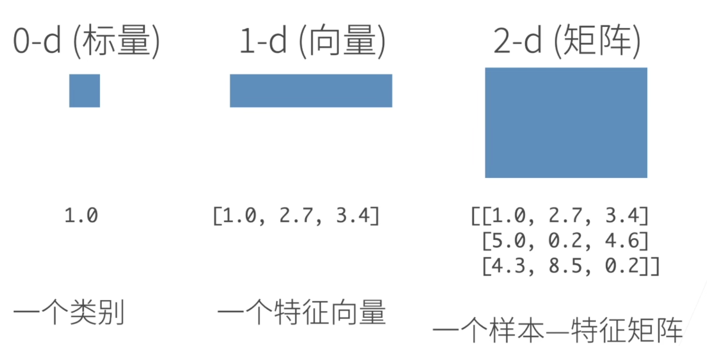
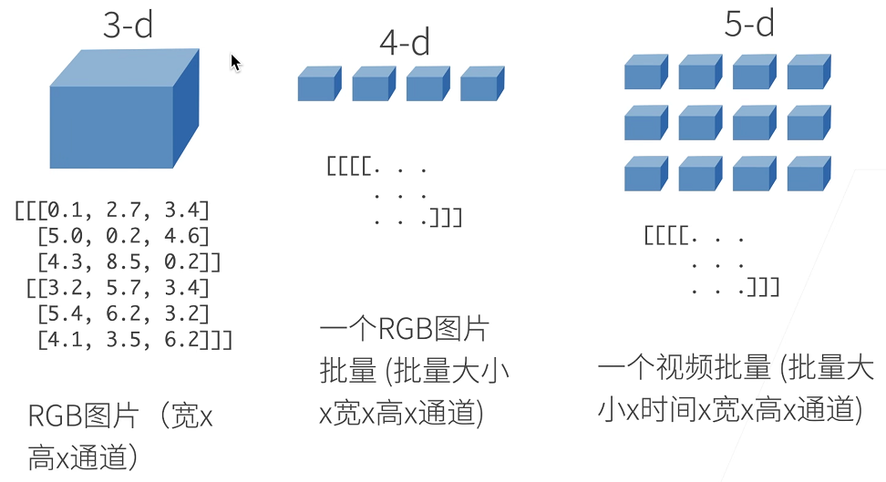
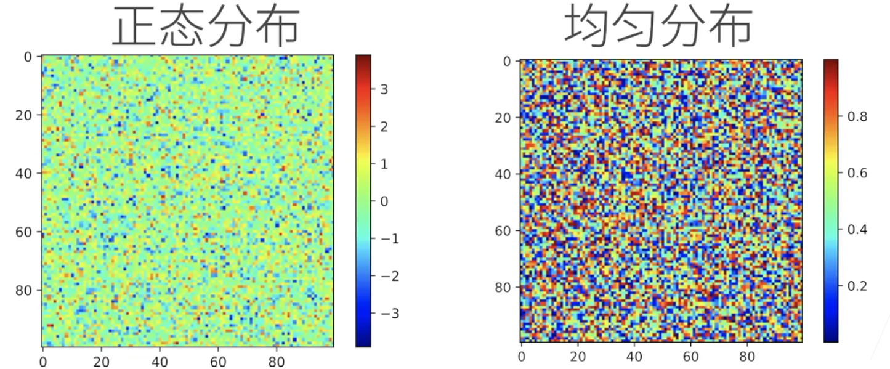
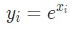

# 目录

[toc]

---

[source]()


### 1. 数据操作

为了能够完成各种数据操作，我们需要某种方法来存储和操作数据。通常，我们需要做两件重要的事：

1. 获取数据；
2. 将数据读入计算机后对其进行处理。

如果没有某种方法来存储数据，那么获取数据是没有意义的。

首先，我们介绍 n 维数组，也称为 ==**张量**（tensor）==。PyTorch的**张量类**与Numpy的 `ndarray` 类似。
但在深度学习框架中应用 ==PyTorch 的**张量类**，又比 Numpy 的`ndarray`多一些重要功能==：

1. **tensor 可以在很好地支持 GPU 加速计算，而 NumPy 仅支持 CPU 计算；**
2. **tensor 支持自动微分**。

这些功能使得张量类更适合深度学习。

#### 1.1 基本操作

**张量表示由一些数值组成的数组，这个数组可能有多个维度**。
- 具有一个轴的张量对应数学上的 **向量**（vector）；
- 具有两个轴的张量对应数学上的 **矩阵**（matrix）；
- 具有两个轴以上的张量没有特殊的数学名称。


**N 维数组是机器学习和神经网络的主要数据结构**

- 0-d（标量）：一个类别
- 1-d（向量）：一个特征向量
- 2-d（矩阵）：一个样本 —— 特征矩阵
- 3-d：RGB图片（宽 x 高通道）
- 4-d：一个RGB图片批量（批量大小 x 宽 x 高 x 通道）
- 5-d：一个视频批量（批量大小 x 时间 x 宽 x 高 x 通道）


</img></img>


##### 1.1.1 创建数组

创建数组需要
- 形状 shape：例如 3x4 矩阵
- 每个元素的数据类型 type：例如 32 位浮点数
- 每个元素的值 value，例如全是 0，或者随机数

</img>

**正态分布**：所有的值按照正态分布
**均匀分布**：所有的值在 0-1 之间分布


我们可以使用 `arange` 创建一个行向量 `x` 。
这个行向量包含从 0 开始的前 12 个整数，它们被 **默认创建为浮点数**。
张量中的每个值都称为张量的**元素**（ element ）。

例如，张量 `x` 中有 12 个元素。除非额外指定，新的张量默认将存储在内存中，并采用基于 CPU 的计算。

```python
x = torch.arange(12)    # tensor([ 0,  1,  2,  3,  4,  5,  6,  7,  8,  9, 10, 11])
```

**可以通过张量的 `shape` 属性来访问张量（沿每个轴的长度）的*形状***。

```python
ret = x.shape   # torch.Size([12])
```
如果只想知道张量中元素的总数，即形状的所有元素乘积，可以检查它的大小（size）。
因为这里在处理的是一个向量，所以它的`shape`与它的`size`相同。
在处理更高维度的的张量时，可以用这种方法获取张量中元素的个数。

```python
ret = x.numel()     # 12
```

**要想 <u>改变一个张量的形状</u> 而不改变元素数量和元素值，可以调用`reshape`函数。**

例如，可以把张量`x`从形状为（12,）的行向量转换为形状为（3,4）的矩阵。
这个新的张量包含与转换前相同的值，但是它被看成一个3行4列的矩阵。
值得注意的是，虽然张量的形状发生了改变，但其元素值并没有变。
改变张量的形状时，张量中元素的个数不会改变。

```python
X = x.reshape(3, 4)
print(X)
# tensor([[ 0,  1,  2,  3],
#         [ 4,  5,  6,  7],
#         [ 8,  9, 10, 11]])
```

我们不需要通过手动指定每个维度来改变形状。
如果我们的目标形状是（高度 x 宽度），那么在知道宽度后，高度会被自动计算得出，不必我们自己做除法。
==我们可以通过`-1`来调用此自动计算出维度的功能==，
即可以用 `x.reshape(-1, 4)` 或 `x.reshape(3, -1)` 来取代 `x.reshape(3, 4)`。

##### 1.1.2 初始化矩阵变量

- **1、使用全0、全1、其他常量**

有时，我们希望[**使用全0、全1、其他常量，或者从特定分布中随机采样的数字**] 来初始化矩阵。
我们可以创建一个形状为（2,3,4）的张量，其中所有元素都设置为 0 或者 1。

```python
w1 = torch.zeros((2, 3, 4))
print(w1)
# tensor([[[0., 0., 0., 0.],
#          [0., 0., 0., 0.],
#          [0., 0., 0., 0.]],

#         [[0., 0., 0., 0.],
#          [0., 0., 0., 0.],
#          [0., 0., 0., 0.]]])

w2 = torch.ones((2, 3, 4))
print(w2)
# tensor([[[1., 1., 1., 1.],
#          [1., 1., 1., 1.],
#          [1., 1., 1., 1.]],

#         [[1., 1., 1., 1.],
#          [1., 1., 1., 1.],
#          [1., 1., 1., 1.]]])
```

- **2、从某个特定的概率分布中随机采样来得到张量中每个元素的值**

有时我们想通过从某个特定的概率分布中随机采样来得到张量中每个元素的值。
例如，当我们构造数组来作为神经网络中的参数时，我们通常会随机初始化参数的值。
以下代码创建一个形状为（3,4）的张量。
其中的 **每个元素都 ==从均值为 0、标准差为 1 的标准正态分布中随机采样==**。

```python
w3 = torch.randn(3, 4)
print(w3)
# tensor([[ 0.1364,  0.3546, -0.9091, -1.8926],
#         [ 0.5786, -0.9019, -0.1305, -0.1899],
#         [ 0.5696,  1.1626, -0.5987,  0.4085]])
```

- **3、给定确定的值来初始化张量中每个元素的值**

我们还可以 [**通过提供包含数值的Python列表（或嵌套列表），来为所需张量中的每个元素赋予确定值**]。
在这里，最外层的列表对应于轴 0，内层的列表对应于轴 1。

```python
w4 = torch.tensor([[2, 1, 4, 3], [1, 2, 3, 4], [4, 3, 2, 1]])
print(w4)
# tensor([[2, 1, 4, 3],
#         [1, 2, 3, 4],
#         [4, 3, 2, 1]])
```

<br>

#### 1.2 简单运算

我们想在这些数据上执行数学运算，其中最简单且最有用的操作是**按元素**（elementwise）运算。
它们将标准标量运算符应用于数组的每个元素。
对于将两个数组作为输入的函数，按元素运算将二元运算符应用于两个数组中的每对位置对应的元素。
我们可以基于任何从标量到标量的函数来创建按元素函数。
我们 ==通过将标量函数升级为 **按元素向量运算来生成向量值** $F: \mathbb{R}^d, \mathbb{R}^d \rightarrow \mathbb{R}^d$。==

对于任意具有相同形状的张量，

##### 1.2.1 **常见的标准算术运算符（`+`、`-`、`*`、`/`和`**`）**

常见的标准算术运算符（`+`、`-`、`*`、`/`和`**`）都可以被升级为按元素运算
我们可以在同一形状的任意两个张量上调用按元素操作。

```python
import torch

x = torch.tensor([1.0, 2, 4, 8])    # 给一个 1.0，则是浮点数组，不给 1.0 这是整形数组
y = torch.tensor([2, 2, 2, 2])
ret = (
    x + y, 
    x - y, 
    x * y, 
    x / y, 
    x ** y  # 求幂运算（多少立方）
)
print(ret)                                      # 其中每个元素都是按元素操作的结果
```
```python
# (tensor([ 3.,  4.,  6., 10.]),                x + y
#  tensor([-1.,  0.,  2.,  6.]),                x - y
#  tensor([ 2.,  4.,  8., 16.]),                x * y
#  tensor([0.5000, 1.0000, 2.0000, 4.0000]),    x / y
#  tensor([ 1.,  4., 16., 64.]))                x ** y
```

**`exp(x)`**：对 x 中的每个元素做指数运算 

```python
w = torch.exp(x)
print(w)
# tensor([2.7183e+00, 7.3891e+00, 5.4598e+01, 2.9810e+03])
```

##### 1.2.2 **把多个张量 concatenate 在一起**，

我们也可以把多个张量（concatenate）在一起
把它们端对端地叠起来形成一个更大的张量。我们只需要提供张量列表，并给出沿哪个轴连结。

下面的例子分别演示了当我们沿行（轴-0）和按列（轴-1）连结两个矩阵时，会发生什么情况。
我们可以看到，第一个输出张量的轴-0长度（$6$）是两个输入张量轴-0长度的总和（$3 + 3$）；
第二个输出张量的轴-1长度（$8$）是两个输入张量轴-1长度的总和（$4 + 4$）。

```python
import torch

X = torch.arange(12, dtype=torch.float32).reshape((3,4))
Y = torch.tensor([
        [2.0, 1, 4, 3], [1, 2, 3, 4], [4, 3, 2, 1]
    ])

# cat 拼接张量
tensor1 = torch.cat((X, Y), dim=0)
tensor2 = torch.cat((X, Y), dim=1)

# --------------------
print("X:\n{}".format(X))
print("Y:\n{}".format(Y))
print("tensor1:\n{}".format(tensor1))
print("tensor2:\n{}".format(tensor2))
```
```python
# X:
# tensor([[ 0.,  1.,  2.,  3.],
#         [ 4.,  5.,  6.,  7.],
#         [ 8.,  9., 10., 11.]])
# Y:
# tensor([[2., 1., 4., 3.],
#         [1., 2., 3., 4.],
#         [4., 3., 2., 1.]])
# tensor1:
# tensor([[ 0.,  1.,  2.,  3.],
#         [ 4.,  5.,  6.,  7.],
#         [ 8.,  9., 10., 11.],
#         [ 2.,  1.,  4.,  3.],
#         [ 1.,  2.,  3.,  4.],
#         [ 4.,  3.,  2.,  1.]])
# tensor2:
# tensor([[ 0.,  1.,  2.,  3.,  2.,  1.,  4.,  3.],
#         [ 4.,  5.,  6.,  7.,  1.,  2.,  3.,  4.],
#         [ 8.,  9., 10., 11.,  4.,  3.,  2.,  1.]])
```


由上述例子可见，
当需要按轴-x连结两个张量时，我们就在第x+1层括号内将两张量中的元素相组合。
类似地，我们将两个三维张量相连结。

```python
import torch

X = torch.arange(12, dtype=torch.float32).reshape((3, 2, 2))
Y = torch.tensor([
    [[2.0, 1], [4, 3]],
    [[1, 2], [3, 4]],
    [[4, 3], [2, 1]]
])

tensor1 = torch.cat((X, Y), dim=0)  # 第 1 个维度聚合
tensor2 = torch.cat((X, Y), dim=1)  # 第 2 个维度聚合
tensor3 = torch.cat((X, Y), dim=2)  # 第 3 个维度聚合

# -----------------------------
print("X:\n{}".format(X))
print("Y:\n{}".format(Y))
print("tensor1:\n{}".format(tensor1))
print("tensor2:\n{}".format(tensor2))
print("tensor3:\n{}".format(tensor3))
```
```python
# X:
# tensor([[[ 0.,  1.],
#          [ 2.,  3.]],

#         [[ 4.,  5.],
#          [ 6.,  7.]],

#         [[ 8.,  9.],
#          [10., 11.]]])
# Y:
# tensor([[[2., 1.],
#          [4., 3.]],

#         [[1., 2.],
#          [3., 4.]],

#         [[4., 3.],
#          [2., 1.]]])
# tensor1:
# tensor([[[ 0.,  1.],
#          [ 2.,  3.]],

#         [[ 4.,  5.],
#          [ 6.,  7.]],

#         [[ 8.,  9.],
#          [10., 11.]],

#         [[ 2.,  1.],
#          [ 4.,  3.]],

#         [[ 1.,  2.],
#          [ 3.,  4.]],

#         [[ 4.,  3.],
#          [ 2.,  1.]]])
# tensor2:
# tensor([[[ 0.,  1.],
#          [ 2.,  3.],
#          [ 2.,  1.],
#          [ 4.,  3.]],

#         [[ 4.,  5.],
#          [ 6.,  7.],
#          [ 1.,  2.],
#          [ 3.,  4.]],

#         [[ 8.,  9.],
#          [10., 11.],
#          [ 4.,  3.],
#          [ 2.,  1.]]])
# tensor3:
# tensor([[[ 0.,  1.,  2.,  1.],
#          [ 2.,  3.,  4.,  3.]],

#         [[ 4.,  5.,  1.,  2.],
#          [ 6.,  7.,  3.,  4.]],

#         [[ 8.,  9.,  4.,  3.],
#          [10., 11.,  2.,  1.]]])
```


##### 1.2.3 **通过*逻辑运算符*构建二元张量**。 

以`X == Y`为例： 
对于每个位置，如果`X`和`Y`在该位置相等，则新张量中相应项的值为 1。 
这意味着逻辑语句`X == Y`在该位置处为真，否则该位置为 0。

```python
import torch

X = torch.arange(12, dtype=torch.float32).reshape((3,4))
Y = torch.tensor([
        [2.0, 1, 4, 3], [1, 2, 3, 4], [4, 3, 2, 1]
    ])

tensor1 = X == Y        # 通过逻辑运算符构建二元张量

# -----------------------------
print("X:\n{}".format(X))
print("Y:\n{}".format(Y))
print("tensor1:\n{}".format(tensor1))
```
```py
# X:
# tensor([[ 0.,  1.,  2.,  3.],
#         [ 4.,  5.,  6.,  7.],
#         [ 8.,  9., 10., 11.]])
# Y:
# tensor([[2., 1., 4., 3.],
#         [1., 2., 3., 4.],
#         [4., 3., 2., 1.]])
# tensor1:
# tensor([[False,  True, False,  True],
#         [False, False, False, False],
#         [False, False, False, False]])
```


##### 1.2.4 **对张量中的所有元素进行求和**

对张量中的所有元素进行求和，会产生一个单元素张量。
```python
import torch

X = torch.arange(12, dtype=torch.float32).reshape((3,4))
Y = torch.tensor([
        [2.0, 1, 4, 3], [1, 2, 3, 4], [4, 3, 2, 1]
    ])

tensor_sum = X.sum()       # 求和

# -----------------------------
print("X:\n{}".format(X))
print("Y:\n{}".format(Y))
print("tensor_sum:\n{}".format(tensor_sum))
```
```python
# X:
# tensor([[ 0.,  1.,  2.,  3.],
#         [ 4.,  5.,  6.,  7.],
#         [ 8.,  9., 10., 11.]])
# Y:
# tensor([[2., 1., 4., 3.],
#         [1., 2., 3., 4.],
#         [4., 3., 2., 1.]])
# tensor_sum:
# 66.0
```

#### 1.3 广播机制

在上面的部分中，我们看到了如何在相同形状的两个张量上执行按元素操作。
在某些情况下，[**即使形状不同，我们仍然可以通过调用*广播机制*（broadcasting mechanism）来执行按元素操作**]。

这种机制的工作条件是：
两个张量从后开始数，==**每个维度相等或者其中一个为 1**==。

这种机制的工作方式如下：
首先，通过适当==复制元素==来扩展一个或两个数组，以便在转换之后，两个张量具有相同的形状。
其次，对生成的数组执行按元素操作。

在大多数情况下，我们将==沿着数组中 **长度为 1 的轴** 进行广播（复制长度为 1 的轴的元素）==，
如下例子：
```python
import torch

a = torch.arange(3).reshape((3, 1))
b = torch.arange(2).reshape((1, 2))
tensor_sum = a + b       # 求和，注意 a,b 两个张量的维度不一样

# -----------------------------
print("a:\n{}".format(a))
print("b:\n{}".format(b))
print("tensor_sum:\n{}".format(tensor_sum)) # 注意不同维度的张量相加之后的结果
```
```python
# a:
# tensor([[0],
#         [1],
#         [2]])
# b:
# tensor([[0, 1]])
# tensor_sum:
# tensor([[0, 1],
#         [1, 2],
#         [2, 3]])
```

由于 `a` 和 `b` 分别是 $3\times1$ 和 $1\times2$ 矩阵，如果让它们相加，它们的形状不匹配。
我们将两个矩阵 **广播** 为一个更大的 $3\times2$ 矩阵，
**矩阵 `a` 复制列，矩阵 `b` 复制行**，然后再按元素相加。
需要注意的是，**==广播机制只能扩展维度，而不能凭空增加张量的维度==**，

例如：在计算沿某个轴的均值时，若张量维度不同，则会报错：

```python
import torch

C = torch.arange(24, dtype=torch.float32).reshape(2, 3, 4)
print("C:\n{}".format(C))

tensor_sum = C.sum(axis=1)
print("tensor_sum:\n{}".format(tensor_sum))

ret = C / tensor_sum
print("ret:\n{}".format(ret))
```
```python
"""
C:
tensor([[[ 0.,  1.,  2.,  3.],
         [ 4.,  5.,  6.,  7.],
         [ 8.,  9., 10., 11.]],

        [[12., 13., 14., 15.],
         [16., 17., 18., 19.],
         [20., 21., 22., 23.]]])

tensor_sum:
tensor([[12., 15., 18., 21.],
        [48., 51., 54., 57.]])

Traceback (most recent call last):
  File ".../code/01_test.py", line 9, in <module>
    ret = C / tensor_sum
RuntimeError: The size of tensor a (3) must match the size of tensor b (2) at non-singleton dimension 1
"""
```

此时我们需要==将`keepdims`设为 True==，才能正确利用广播机制扩展 `C.sum(axis=1)` 的维度：

```python
import torch

C = torch.arange(24, dtype=torch.float32).reshape(2, 3, 4)
print("C:\n{}".format(C))

tensor_sum = C.sum(axis=1, keepdims=True)    # keepdims 参数: 设置是否保持输入的维度
print("tensor_sum:\n{}".format(tensor_sum))

ret = C / tensor_sum
print("ret:\n{}".format(ret))
```
```python
"""
C:
tensor([[[ 0.,  1.,  2.,  3.],
         [ 4.,  5.,  6.,  7.],
         [ 8.,  9., 10., 11.]],

        [[12., 13., 14., 15.],
         [16., 17., 18., 19.],
         [20., 21., 22., 23.]]])

tensor_sum:
tensor([[[12., 15., 18., 21.]],

        [[48., 51., 54., 57.]]])

ret:
tensor([[[0.0000, 0.0667, 0.1111, 0.1429],
         [0.3333, 0.3333, 0.3333, 0.3333],
         [0.6667, 0.6000, 0.5556, 0.5238]],

        [[0.2500, 0.2549, 0.2593, 0.2632],
         [0.3333, 0.3333, 0.3333, 0.3333],
         [0.4167, 0.4118, 0.4074, 0.4035]]])
"""
```

#### 1.4 索引和切片

就像在任何其他 Python 数组中一样，张量中的元素可以通过索引访问。
与任何 Python 数组一样：第一个元素的索引是 0 ，最后一个元素索引是 -1 ；
可以指定范围以包含第一个元素和最后一个之前的元素。


```python
import torch

X = torch.arange(12, dtype=torch.float32).reshape((3,4))
print("X:\n{}".format(X))
```
```python
# X:
# tensor([[ 0.,  1.,  2.,  3.],
#         [ 4.,  5.,  6.,  7.],
#         [ 8.,  9., 10., 11.]])
```
如下所示，我们 **可以用`[-1]`选择最后一个元素，可以用`[1:3]`选择第二个和第三个元素**：
```python

a = X[-1]
b = X[1:3]

print("a:\n{}".format(a))
print("b:\n{}".format(b))
```
```python
# a:
# tensor([ 8.,  9., 10., 11.])
# b:
# tensor([[ 4.,  5.,  6.,  7.],
#         [ 8.,  9., 10., 11.]])
```

我们[**可以用`[::2]`每间隔一个元素选择一个元素，可以用`[::3]`每间隔两个元素选择一个元素**]：

```python
a = X[::2, ::3]
print("a:\n{}".format(a))
```
```python
# a:
# tensor([[ 0.,  3.],
#         [ 8., 11.]])
```

[**除读取外，我们还可以通过指定索引来将元素写入矩阵。**]

```python
X[1, 2] = 9
# tensor([[ 0.,  1.,  2.,  3.],
#     	[ 4.,  5.,  9.,  7.],
#    	 	[ 8.,  9., 10., 11.]])
```

如果我们想[**为多个元素赋值相同的值，我们只需要索引所有元素，然后为它们赋值。**]例如，`[0:2, :]`访问第1行和第2行，其中“:”代表沿轴1（列）的所有元素。虽然我们讨论的是矩阵的索引，但这也适用于向量和超过2个维度的张量。

```python
X[0:2, :] = 12
# tensor([[12., 12., 12., 12.],
#         [12., 12., 12., 12.],
#         [ 8.,  9., 10., 11.]])
```

#### 1.5 节约内存

[**如果在后续计算中没有重复使用`X`，我们也可以使用`X[:] = X + Y`或`X += Y`来减少操作的内存开销。**]

```python
before = id(X)
X += Y
id(X) == before     # True
```

#### 1.6 转换为其他Python对象

将深度学习框架定义的张量[**转换为NumPy张量（`ndarray`）**]很容易，反之也同样容易。torch张量和numpy数组将共享它们的底层内存，就地操作更改一个张量也会同时更改另一个张量。

```python
A = X.numpy()
B = torch.tensor(A)
print(type(A), type(B))
# (numpy.ndarray, torch.Tensor)
```

要(**将大小为1的张量转换为Python标量**)，我们可以调用`item`函数或Python的内置函数。

```python
a = torch.tensor([3.5])
print(a, a.item(), float(a), int(a))
# (tensor([3.5000]), 3.5, 3.5, 3)
```

### 2. 数据预处理

为了能用深度学习来解决现实世界的问题，我们经常从预处理原始数据开始，而不是从那些准备好的张量格式数据开始。在Python中常用的数据分析工具中，我们通常使用`pandas`软件包。像庞大的Python生态系统中的许多其他扩展包一样，`pandas`可以与张量兼容。本节我们将简要介绍使用`pandas`预处理原始数据，并将原始数据转换为张量格式的步骤。

#### 2.1 读取数据集

举一个例子，我们首先(**创建一个人工数据集，并存储在CSV（逗号分隔值）文件**)`../data/house_tiny.csv`中。以其他格式存储的数据也可以通过类似的方式进行处理。下面我们将数据集按行写入CSV文件中。

```python
>>> import os
>>> os.makedirs(os.path.join('..', 'data'), exist_ok=True)
>>> data_file = os.path.join('..', 'data', 'house_tiny.csv')
>>> with open(data_file, 'w') as f:
>>>     f.write('NumRooms,Alley,Price\n')  # 列名
>>>     f.write('NA,Pave,127500\n')  # 每行表示一个数据样本
>>>     f.write('2,NA,106000\n')
>>>     f.write('4,NA,178100\n')
>>>     f.write('NA,NA,140000\n')
```

要[**从创建的CSV文件中加载原始数据集**]，我们导入`pandas`包并调用`read_csv`函数。该数据集有四行三列。其中每行描述了房间数量（“NumRooms”）、巷子类型（“Alley”）和房屋价格（“Price”）。

```python
>>> import pandas as pd
>>> data = pd.read_csv(data_file)
>>> print(data)
```

|      | NumRooms | Alley | Price  |
| :--: | :------: | :---: | :----: |
|  0   |   NaN    | Pave  | 127500 |
|  1   |   2.0    |  NaN  | 106000 |
|  2   |   4.0    |  NaN  | 178100 |
|  3   |   NaN    |  NaN  | 140000 |


<br>
<br><br><br><br><br><br><br>


.
#### 2.2 处理缺失值

“NaN”项代表缺失值。[**为了处理缺失的数据，典型的方法包括*插值法*和*删除法*，**]其中插值法用一个替代值弥补缺失值，而删除法则直接忽略缺失值。通过位置索引`iloc`，我们将`data`分成`inputs`和`outputs`，其中前者为`data`的前两列，而后者为`data`的最后一列。对于`inputs`中缺少的数值，我们用同一列的均值替换“NaN”项。

```python
>>> inputs, outputs = data.iloc[:, 0:2], data.iloc[:, 2]
>>> inputs = inputs.fillna(inputs.mean())
>>> print(inputs)
```

|      | NumRooms | Alley |
| :--: | :------: | :---: |
|  0   |   3.0    | Pave  |
|  1   |   2.0    |  NaN  |
|  2   |   4.0    |  NaN  |
|  3   |   3.0    |  NaN  |

利用删除法，我们删除缺失元素最多的一个样本。首先，`data.isnull()`矩阵统计每个元素是否缺失，之后在轴-1的方向上将`data.isnull()`元素求和，得到每个样本缺失元素个数，取得缺失元素个数最大的样本的序号，并将其删除。

```python
>>> nan_numer = data.isnull().sum(axis=1)
>>> nan_max_id = nan_numer.idxmax()
>>> data_delete = data.drop([nan_max_id], axis=0)
```

|      | NumRooms | Alley | Price  |
| :--: | :------: | :---: | :----: |
|  0   |   NaN    | Pave  | 127500 |
|  1   |   2.0    |  NaN  | 106000 |
|  2   |   4.0    |  NaN  | 178100 |

一般情况下，利用`dropna`删除数据，其中•Axis哪个维度How如何删除，‘any’表示有nan即删除，‘all’表示全为nan删除，Thresh有多少个nan删除，Subset在哪些列中查找nan，Inplace是否原地修改。

```python
dropna( axis=0, how=‘any’, thresh=None, subset=None, inplace=False)
```

[**对于`inputs`中的类别值或离散值，我们将“NaN”视为一个类别。**]由于“巷子类型”（“Alley”）列只接受两种类型的类别值“Pave”和“NaN”，`pandas`可以自动将此列转换为两列“Alley_Pave”和“Alley_nan”。巷子类型为“Pave”的行会将“Alley_Pave”的值设置为1，“Alley_nan”的值设置为0。缺少巷子类型的行会将“Alley_Pave”和“Alley_nan”分别设置为0和1。

```python
>>> inputs = pd.get_dummies(inputs, dummy_na=True)
>>> print(inputs)
```

|      | NumRooms | Alley_Pave | Alley_nan |
| :--: | :------: | :--------: | :-------: |
|  0   |   3.0    |     1      |     0     |
|  1   |   2.0    |     0      |     1     |
|  2   |   4.0    |     0      |     1     |
|  3   |   3.0    |     0      |     1     |

#### 2.3 转换为张量格式

[**现在`inputs`和`outputs`中的所有条目都是数值类型，它们可以转换为张量格式。**]

```python
>>> import torch
>>> X, y = torch.tensor(inputs.values), torch.tensor(outputs.values)
	(tensor([[3., 1., 0.],
         	 [2., 0., 1.],
         	 [4., 0., 1.],
         	 [3., 0., 1.]], dtype=torch.float64),
 	 tensor([127500, 106000, 178100, 140000]))
```

### 3. Q&A

**`Q1：reshape和view的区别？`**

>View为浅拷贝，只能作用于连续型张量；Contiguous函数将张量做深拷贝并转为连续型；Reshape在张量连续时和view相同，不连续时等价于先contiguous再view。

**`Q2：数组计算吃力怎么办？`**

> 学习numpy的知识。

**`Q3：如何快速区分维度？`**

> 利用`a.shape`或`a.dim()`。

**`Q4：Tensor和Array有什么区别？`**

> Tensor是数学上定义的张量，Array是计算机概念数组，但在深度学习中有时将Tensor视为多维数组。

**`Q5：新分配了y的内存，那么之前y对应的内存会自动释放吗？`**

> Python会在不需要时自动释放内存。


<br><br><br><br><br><br><br><br>

<!-- 
</img>

 -->


