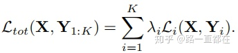
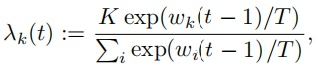

# 目录

[toc]

---

[出处](https://zhuanlan.zhihu.com/p/82234448)

# End-to-End Multi-Task Learning with Attention

<b style="font-size:24px">（端对端，多任务注意力学习）</b>

> **Paper link :**
End-to-End Multi-Task Learning with Attention
https://arxiv.org/abs/1803.10704v1

> **Code link :**
lorenmt/mtan
https://github.com/lorenmt/mtan

# 1。Abstract
本文提出了一种新的多任务学习体系结构，允许学习特定任务的特征级注意力。
提出了 **<red>MTAN（Multi-Task Attention Netwrok）</red>** 网络，
由一个包含 **①<u>全局特征池化的共享网络</u>** 和 **②<u>基于特定任务的 soft-attention 模块</u>** 组成。

这些模块==从全局共享特征中学习特定任务的特征，同时允许特征在不同任务间共享==。
该体系结构可以端到端训练，<u>可以建立在任意前向神经网络上</u>，实现简单，参数效率高。

通过在大量数据集上的实验，在图像分类和预测任务中都取得了很好的效果，
还有很重要的一点是，该网络 <u>对于 **多任务损失函数中各种权重方案** 的敏感性较低</u>。

# 2。Introduction
将卷积神经网络 CNN 应用于计算机视觉任务已经取得了很大的成功，在图像分类，实例分割，风格迁移等领域都有广泛应用。
但是这些模型的设计都是单任务的，
对于一个现实生活中的计算机视觉任务来说，**一个网络同时完成多个任务是更符合实际的**，
这不仅在内存和推理速度方面更有效，而且在数据方面也更有效，**因为相关任务可能共享信息可视化特性**。
关于多任务，我之前写过一个综述类的文章，想了解更多，可以点击阅读
> 路一直都在：关于多任务学习（MTL），我们应该知道的事
> https://zhuanlan.zhihu.com/p/65361946

于是，多任务学习应运而生，
**多任务网络结构旨在学习不同任务间的共享表示，增强模型的健壮性和泛化性能**，
与单任务模型相比，多任务网络在设计中面临的挑战主要有两方面：
1. Network Architecture（网络结构的设计）
2. Loss Function（损失函数设计）：

## 2.1、Network Architecture（网络结构的设计）

一个好的多任务网络结构，必然需要有好的任务共享层特征表示和特定任务层的特征表示。
因此，一方面为了避免过拟合，网络必须学到数据的通用特征表示；
另一方面，必须具备学习针对特定任务特征表示的能力。

## 2.2、Loss Function（损失函数设计）

多任务学习中，应赋予每个子任务相同的重要性，
但 **不同子任务的收敛速度，训练难度都是不同的**，
不能让简单任务主导整个训练，导致各个子任务的表现差距过大，
手工调整子任务的权重是一项繁琐的工作，最好是自动学习权重，或者设计一个对不同权重具有鲁棒性的网络。

但是，当前主流的多任务模型只能针对其中的一个问题进行解决，很难兼顾两个挑战，
本文提出了一个统一的框架 **MTAN（Multi-Task Attention Netwrok）**，旨在同时解决上述两个挑战。

<u>MTAN 首先有一个单一共享网络，通过该网络学习所有任务的共享特征表示，
然后，针对每个子任务，通过 soft-attention 模块从主网络从获取对自己有用的 feature 进行计算，</u>

好处：
通过这种方式，每个子任务中的注意力机制模块能够自动决定共享特征中对子任务的重要程度，
这种灵活性使我们能够学习到更有表现力的特性组合，以便在不同任务之间进行泛化，
同时还允许为每个单独的任务定制有区别的特性，最后达到多任务计算的效果。
此外，自动选择要共享哪些特征以及哪些特征是特定于任务的，会极大的减轻参数的负担，使得模型更高效。

根据任务类型的不同， MTAN 可以建立在任何前向神经网络上，
作者在不同的网络结构上用不同测试集进行测试，
在分割，深度估计，分类等计算机视觉任务中都取得了很好的效果，
更重要的是，这些效果的取得是在更高效的参数已经更健壮性的权重设计的情况下，

此外，本文还提出了一种 <u>**新的权重设计机制** <red>DWA（Dynamic Weight Average）</red></u>，
通过 **考虑 ==每个任务损失的变化率== 来调整任务权重**。

关于计算机视觉中的注意力机制，如果您想了解更多，可以参考以下几篇文章
> 计算机视觉中的注意力机制（Visual Attention）
> https://blog.csdn.net/paper_reader/article/details/81082351

> 张戎：计算机视觉中的注意力机制
> https://zhuanlan.zhihu.com/p/56501461

# 3。**M**ulti-**T**ask **A**ttention **N**etwork

==**MTAN 可以很方便的和任意前向传播网络融合**==，
本节以 SegNet 为例，说明如何通过将 MTAN 加到编解码结构中去，
并在分割，深度估计等任务中取得 SOTA 。

SegNet网络结构图：

##  3.1 **MTAN** 结构设计

MTAN 结构主要包括两大部分，**一个任务共享的主网络** 和 **K 个特定任务的子网络**，
共享网络可以根据特定的任务进行设计，
而每个特定于任务的子网络由一组注意力模块组成，这些模块与共享网络相连接。
每个注意力模块对共享网络的特定层应用一个 soft attention mask ，以学习特定于任务的特征。
基于这种设计，共享主网络可以看做是一个跨任务的特征表示，
每一个 attention mask 都可以被看作是对主网络的特征选择器，决定哪些共享特征被用到自己的子任务中去。

下图是 MTAN 的结构图，以 VGG-16 为主网络架构，
因为 SegNet 的对称设计，只给出了编码器部分，
**任务一（绿色）和任务二（蓝色）的注意力模块，与共享网络（灰色）相连，决定了主网络那些特征会被利用到子网络中**。
中间是一个注意力模块的内部结构

我们把注意力模块的内部结构再细化，如下图所示，
该层的共享特征（U）首先跟上一个 attention 模块的输出进行 Merge ，具体方式为 Concatenation( 维度相加 ) 
，然后，将融合后的结果作为输入，经过如下操作：

g ： 1x1 卷积， BN 层， ReLu 激活函数
h ： 1x1 卷积， BN 层， Sigmoid 激活函数
a ：得到对应的 attention mask
p ：将 attention mask 与主网络特征进行 Element-wise Multiplication （对应元素相乘）
a ：得到筛选出的特征
f ： 3x3 卷积， BN 层， ReLu 激活函数

由于每个 attention 中的 mask 是根据主网络相应层的共享特征学到的，
因此两者可以联合学习，使得网络 **在不同任务中泛化性能更好，同时提升在特定任务中的表现**。

## 3.2 子网络中的注意力模块设计

attention 模块的设计初衷是
通过一个 attention mask 从共享网络中学到特定任务的特征，对特征的每一个通道都加入一个 mask 。

如下式所示，任务 i <u>在第 j 层学到的 mask 和第 j 层的共享特征进行 Element-wise Multiplication</u> ，
就得到了本层中特定与该任务的特征。

我们再把 ai 详细展开，可以用下式进行表示：

其中，**`h(i)，g(i)，f`** 与上文中的 **`h，g，f`** 相对应

我们应该注意到，在得到 mask 前采用的激活函数是 **Sigmoid，能把 mask 的每个值压到 `[0,1]`**，
如果 ai 趋向于 1 ，说明 mask 几乎成为同等映射，与共享网络一致。

## 3.3 损失函数设计
**`K`** 个任务中，以 **`X`** 为输入， **`Y`** 为输出的 为例，
损失函数的形式可以按下式所示：

**`i`** 表示当前子任务的索引
**`λi`** ==表示子任务权重==

这种形式是 **将子任务的损失函数通过权重进行线性组合**，
在实验中，作者研究了不同权重方案对不同多任务学习方法的影响。
以 **`Y`** 为 ground-truth label ， **`Y^`** 为预测值，对每个子任务分开看

- **分割任务**

利用逐像素的交叉熵损失

- **深度估计任务**

利用 L1 范式，对预测值和真实值求偏差累加

- **法向估计任务**

利用最小二乘

<red>TODO（这部分公式没看懂）</red>

# 4。Dynamic Weight Average
对于大多数多任务网络而言，
训练过程中的最大难题是为每一个子任务找到合适的权重，让每个子任务的重要性得到平衡，

解决这些问题的办法有几类，有代表性的有： 
GradNorm 梯度归一化，利用不确定性赋权值，根据任务难易程度进行赋权值等，

本文提出的 DWA ，受 GradNorm 启发，
每个子任务首先计算前个 epoch 对应损失的比值，
然后除以一个固定的值 T ，进行 exp 映射后，计算各个损失所占比。

如下式所示，
首先计算一个 epoch 后的损失变化：

然后，将 **`Wk(t-1)`** 带入下式，得到对应子任务 k 的权重 **`λi`**：

<red>TODO exp 是什么 ？？</red>

其中， **`T`** 是一个常数， **`T`** 的大小代表了任务间的松散程度，
如果 T 足够大，那么 会趋向于 1 ，代表各任务的权重相同。

# 5。Experiments

# 6。Conclusion

本文提出了一种新的多任务学习方法 基于注意力机制的多任务网络 (MTAN) 。
网络体系结构由一个全局特性池和特定任务的注意力模块组成，允许以端到端的方式自动学习任务共享和特定于任务的特性。
通过在多个数据集实验任务和视觉上的十项全能挑战与多个图像分类任务实验表明，
MTAN 方法优于或与其他方法具有竞争力，同时也表现出鲁棒性特定任务权重方案用于损失函数。
此外，本文的方法能够通过 attention mask 共享权重，因此还具有很高的参数效率。

<u></u>

 
            

<!-- 
</img>
</img>
 -->

