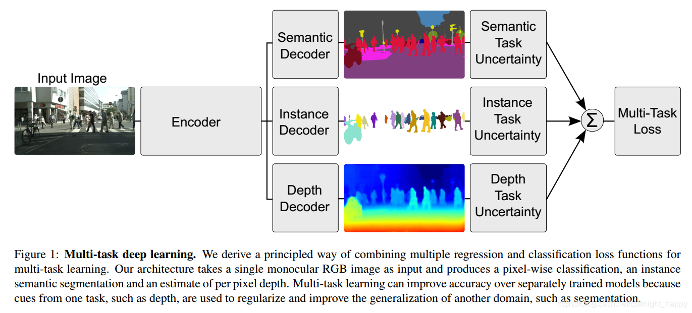

# 目录

[toc]

---

[出处](https://blog.csdn.net/cdknight_happy/article/details/102618883)

# Multi-Task Learning Using Uncertainty to Weigh Losses for Scene Geometry and Semantics

论文：https://arxiv.org/abs/1705.07115v3
代码：https://github.com/yaringal/multi-task-learning-example/blob/master/multi-task-learning-example.ipynb

# 1 问题引出

多任务联合学习可以提升各任务的学习效果，因为多任务可以共享数据集、共享低层特征。

但多任务联合学习时，该 **如何对各子任务的损失函数进行加权** 才能取得最优的训练效果，
这是本文所关心的问题。
本文中作者提出的多任务如下图所示：

对 **各任务的损失确定加权系数 Wi** 可以有多种方式，
把这些系数作为超参数进行调试的代价很大，因此作者提出了基于任务的不确定性确定系数。

# 2 解决方案

在贝叶斯建模中，需要解决两种不同类型的不确定性。

- **认知不确定性**：表示的是模型本身的不确定性，这是因为缺乏训练数据，模型认知不足，可以通过扩充训练集进行解决；
- **偶然不确定性**：表示数据不能解释的信息。偶然不确定性又分成两类：
    - **数据依赖（异方差）不确定性**：依赖于输入数据的不确定性，体现在模型的输出上；
    - **任务依赖（同方差）不确定性**：不取决于输入数据，而是取决于不同的任务。

在多任务联合学习中，任务依赖不确定性能够表示不同任务间的相对难度。
下面证明了 **在多任务学习中可以通过 <u>==任务依赖不确定性==</u> 对不同的损失进行加权**。

## 2.1 多任务似然

下面通过 **最大化同方差不确定性的最大高斯似然** 推导 **多任务损失函数**。

假设输入为 X ，参数矩阵为 W ，输出为 $f^W(x)$

对于回归任务，定义其概率为以输出为均值的高斯似然，即
$$ 
p(y | f^W (x))=N(f^W(x),σ^2 ) 
$$

对于分类任务，定义：
$$ 
p(y∣f ^W(x))=Softmax(f ^W(x)) 
$$

多任务模型，其似然为：
$$ 
p(y_{1},⋯,y_{k}∣f^W (x))=p(y_{1}∣f ^W (x))⋯p(y_{K}∣f ^W (x)) 
$$

回归任务：

对于回归任务，即公式(2)，其对数似然为：
$$
log p(y|f^W(x))\varpropto-\frac{1}{2\sigma^2}||y-f^W(x)||^2-\log\sigma\tag{5}
$$

 
      

<u></u>

<!-- 
</img>
</img>
</img>
 -->

